## 前言
源码解读： [utils/autoanchor.py](https://github.com/Oneflow-Inc/one-yolov5/blob/main/utils/autoanchor.py)

>   这个文件是yolov5的通用工具类，写了一些通用的工具函数，用的很广，整个项目哪里都可能用到。
     这个文件的函数非常多，代码量也很大（上千行了），也都比较重要，希望大家看的时候多点耐心，都能掌握！

- 🎉代码仓库地址：<a href="https://github.com/Oneflow-Inc/one-yolov5" target="blank">https://github.com/Oneflow-Inc/one-yolov5</a>
- 🎉文档网站地址：<a href="https://start.oneflow.org/oneflow-yolo-doc/index.html" target="blank"> https://start.oneflow.org/oneflow-yolo-doc/index.html</a>
- OneFlow 安装方法：<a href="https://github.com/Oneflow-Inc/oneflow#install-oneflow" target="blank"> https://github.com/Oneflow-Inc/oneflow#install-oneflow</a>

不过即使你对 OneFlow 带来的性能提升不太感兴趣，我们相信[文档网站](https://start.oneflow.org/oneflow-yolo-doc/index.html)中对 YOLOv5 教程的汉化以及源码剖析也会是从零开始深入学习 YOLOv5 一份不错的资料。欢迎在仓库给我们提出宝贵的意见。🌟🌟🌟

欢迎star [one-yolov5项目](https://github.com/Oneflow-Inc/one-yolov5) 获取<a href="https://github.com/Oneflow-Inc/one-yolov5/tags" target="blank" >最新的动态。</a>


## 0、导入需要的包和基本配置


```python
# import contextlib   # python上下文管理器   执行with…as…的时候调用contextlib
import glob         # 仅支持部分通配符的文件搜索模块
import logging      # 日志模块
import math         # 数学公式模块
import os           # 与操作系统进行交互的模块
import platform     # 提供获取操作系统相关信息的模块
import random       # 生成随机数的模块
import re           # 用来匹配字符串（动态、模糊）的模块
import signal       # 信号处理模块
import time         # 时间模块 更底层
import urllib       # 用于操作网页URL, 并对网页的内容进行抓取处理  如urllib.parse: 解析url
from itertools import repeat  # 循环器模块  创建一个迭代器，重复生成object
from multiprocessing.pool import ThreadPool  # 多线程模块 线程池
from pathlib import Path  # Path将str转换为Path对象 使字符串路径易于操作的模块
from subprocess import check_output  # 创建一个子进程再命令行执行..., 最后返回执行结果(文件)
from typing import Optional
from zipfile import ZipFile

import cv2 # opencv库
import numpy as np # numpy矩阵处理函数库
import oneflow as flow # OneFlow框架
import oneflow.backends.cudnn as cudnn
import pandas as pd # pandas矩阵操作模块
import pkg_resources as pkg # 用于查找, 自省, 激活和使用已安装的Python发行版
import yaml # yaml配置文件读写模块

from utils.downloads import gsutil_getsize
from utils.metrics import box_iou, fitness


FILE = Path(__file__).resolve()
ROOT = FILE.parents[1]  # YOLOv5 root directory
RANK = int(os.getenv("RANK", -1))

# Settings
DATASETS_DIR = ROOT.parent / "datasets"  # YOLOv5 datasets directory
# 确定最大的线程数 这里被限制在了8
NUM_THREADS = min(8, max(1, os.cpu_count() - 1))  # number of YOLOv5 multiprocessing threads
AUTOINSTALL = str(os.getenv("YOLOv5_AUTOINSTALL", True)).lower() == "true"  # global auto-install mode
VERBOSE = str(os.getenv("YOLOv5_VERBOSE", True)).lower() == "true"  # global verbose mode
FONT = "Arial.ttf"  # https://ultralytics.com/assets/Arial.ttf
# 设置运行相关的一些基本的配置  Settings
# 控制print打印torch.tensor格式设置  tensor精度为5(小数点后5位)  每行字符数为320个  显示方法为long
flow.set_printoptions(linewidth=320, precision=5, profile="long")
# 控制print打印np.array格式设置  精度为5  每行字符数为320个  format short g, %precision=5
np.set_printoptions(linewidth=320, formatter={"float_kind": "{:11.5g}".format})  # format short g, %precision=5
# pandas的最大显示行数是10
pd.options.display.max_columns = 10
# 阻止opencv参与多线程(与 Pytorch的 Dataloader不兼容)
cv2.setNumThreads(0)  # prevent OpenCV from multithreading (incompatible with PyTorch DataLoader)
os.environ["NUMEXPR_MAX_THREADS"] = str(NUM_THREADS)  # NumExpr max threads
os.environ["OMP_NUM_THREADS"] = "1" if platform.system() == "darwin" else str(NUM_THREADS)  # OpenMP (Pyflow and SciPy)
```

## 1、timeout（没用到）
这个函数是自定义的timeout超时函数，如果某个程序执行超时，

就会触发超时处理函数_timeout_handler 返回超时异常信息。

但是这个函数没用到，代码中都是使用库函数自己定义的timeout，没用用这个自定义的timeout函数。

所以这个函数可以了解下就行，不过这种超时提示的代码还是有必要学习的。

timeout函数代码：


```python
class timeout(contextlib.ContextDecorator):
    """没用到  代码中都是使用库函数自己定义的timeout 没用用这个自定义的timeout函数
    设置一个超时函数 如果某个程序执行超时  就会触发超时处理函数_timeout_handler 返回超时异常信息
    并没有用到  这里面的timeout都是用python库函数实现的 并不需要自己另外写一个
    使用: with timeout(seconds):  sleep(10)   或者   @timeout(seconds) decorator
    dealing with wandb login-options timeout issues as well as check_github() timeout issues
    """
    def __init__(self, seconds, *, timeout_msg='', suppress_timeout_errors=True):
        self.seconds = int(seconds)   # 限制时间
        self.timeout_message = timeout_msg  # 报错信息
        self.suppress = bool(suppress_timeout_errors)

    def _timeout_handler(self, signum, frame):
        # 超时处理函数 一旦超时 就在seconds后发送超时信息
        raise TimeoutError(self.timeout_message)

    def __enter__(self):
        # signal.signal: 设置信号处理的函数_timeout_handler
        # 执行流进入with中会执行__enter__方法 如果发生超时, 就会触发超时处理函数_timeout_handler 返回超时异常信息
        signal.signal(signal.SIGALRM, self._timeout_handler)  # Set handler for SIGALRM
        # signal.alarm: 设置发送SIGALRM信号的定时器
        signal.alarm(self.seconds)  # start countdown for SIGALRM to be raised

    def __exit__(self, exc_type, exc_val, exc_tb):
        # 执行流离开 with 块时(没有发生超时), 则调用这个上下文管理器的__exit__方法来清理所使用的资源
        signal.alarm(0)  # Cancel SIGALRM if it's scheduled
        if self.suppress and exc_type is TimeoutError:  # Suppress TimeoutError
            return True

```

## 2、set_logging、init_seeds

这两个函数是一些初始化操作。

set_logging是对日志的设置(format、level)等进行初始化，init_seeds是进行一系列的随机数种子

### 2.1、set_logging
这个函数是对日志的格式、等级等进行一个初始化，但是这个函数没用到。


```python
def set_logging(name=None, verbose=VERBOSE):
    """广泛使用在train.py、test.py、detect.py等文件的main函数的第一步
    对日志的设置(format、level)等进行初始化
    """
    # Sets level and returns logger
    if is_kaggle():
        for h in logging.root.handlers:
            logging.root.removeHandler(h)  # remove all handlers associated with the root logger object
    rank = int(os.getenv("RANK", -1))  # rank in world for Multi-GPU trainings'
    # 设置日志级别 
    level = logging.INFO if verbose and rank in {-1, 0} else logging.ERROR
    log = logging.getLogger(name)
    log.setLevel(level)
    handler = logging.StreamHandler()
    handler.setFormatter(logging.Formatter("%(message)s"))
    handler.setLevel(level)
    log.addHandler(handler)

```

### 2.2、init_seeds
这个函数是使用random.random()、np.random.rand()、init_torch_seeds（调用torch_utils.py中的函数）

等生成一系列的随机数种子，以保证结果的可复现性。

init_seeds函数代码：


```python
def init_seeds(seed=0, deterministic=False):
    # Initialize random number generator (RNG) seeds https://pyflow.org/docs/stable/notes/randomness.html
    # cudnn seed 0 settings are slower and more reproducible, else faster and less reproducible
    # 设置随机数 针对使用random.random()生成随机数的时候相同
    random.seed(seed)    
    # 设置随机数 针对使用np.random.rand()生成随机数的时候相同
    np.random.seed(seed)
    # 为CPU设置种子用于生成随机数的时候相同  并确定训练模式
    flow.manual_seed(seed)
    cudnn.benchmark, cudnn.deterministic = (False, True)
    flow.cuda.manual_seed(seed)
    flow.cuda.manual_seed_all(seed)  # for Multi-GPU, exception safe
```

## 3、get_latest_run

这个函数的作用是查找最近保存的权重文件 last*.pt，用以进行断点续训。

get_latest_run函数代码：


```python
def get_latest_run(search_dir="."):
    # Return path to most recent 'last.pt' in /runs (i.e. to --resume from)
    """用在train.py查找最近的pt文件进行断点续训
    用于返回该项目中最近的模型 'last.pt'对应的路径
    :params search_dir: 要搜索的文件的根目录 默认是 '.'  表示搜索该项目中的文件
    """
    # 从Python版本3.5开始, glob模块支持该"**"指令（仅当传递recursive标志时才会解析该指令)
    # glob.glob函数匹配所有的符合条件的文件, 并将其以list的形式返回
    last_list = glob.glob(f"{search_dir}/**/last", recursive=True)
    # os.path.getctime 返回路径对应文件的创建时间
    # 所以这里是返回路径列表中创建时间最晚(最近的last文件)的路径
    return max(last_list, key=os.path.getctime) if last_list else ""
```

函数在train.py中被调用：
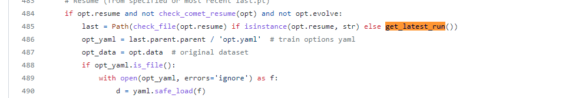

## 4、is_docker、is_colab、is_pip
下面是三个检测函数，is_docker检测当前环境是否是docker环境，

is_colab检查当前环境是否是Google Colab环境，is_pip检测

### 4.1、is_docker
这个函数是查询当前环境是否是docker环境，会用到后面的check_git_status和check_imshow等函数中。

is_docker函数代码：


```python
def is_docker() -> bool:
    """
    在后面的check_git_status和check_imshow等函数中被调用
    查询当前环境是否是docker环境  Is environment a Docker container?
    Check if the process runs inside a docker container.
    """
    if Path("/.dockerenv").exists():
        return True
    try:  # check if docker is in control groups
        with open("/proc/self/cgroup") as file:
            return any("docker" in line for line in file)
    except OSError:
        return False
```

### 4.2、is_colab
这个函数是检查当前环境是否是Google Colab环境，会用到后面的check_imshow函数中。

is_colab函数代码：


```python
def is_colab():
    """用到后面的check_imshow函数中
    检查当前环境是否是Google Colab环境  Is environment a Google Colab instance?
    """
    try:
        import google.colab
        return True
    except Exception as e:
        return False
```

### 4.3、is_pip（没用到）
这个函数是检测当前文件是否在pip package(site-packages)文件里，不过这个函数没用到。

is_pip函数代码：


```python
def is_pip():
    """没用到
    当前文件是否在pip package(site-packages)文件里
    Is file in a pip package?
    """
    return 'site-packages' in Path(__file__).absolute().parts
```

## 5、file_size（没用到）
这个函数是返回本地文件的大小，

功能和之前google_utils.py中的gsutil_getsize函数（返回网站链接对应文件的大小）很像。

不过这个函数并没有用到哦，随便看看就好。


```python

def file_size(path):
    # Return file/dir size (MB) 返回本地文件的大小(MB)
    #:params path: 要查询的文件地址
    mb = 1 << 20  # bytes to MiB (1024 ** 2)
    path = Path(path)
    if path.is_file():
        return path.stat().st_size / mb
    elif path.is_dir():
        # .stat(): 返回文件相关状态  st_size: 返回文件的大小
        return sum(f.stat().st_size for f in path.glob("**/*") if f.is_file()) / mb
    else:
        return 0.0
```

## 6、colorstr
这个函数是将输出的开头和结尾加上颜色，使命令行输出显示会更加好看。

colorstr函数代码：


```python
def colorstr(*input):
    """用到下面的check_git_status、check_requirements等函数  train.py、test.py、detect.py等文件中
    把输出的开头和结尾加上颜色  命令行输出显示会更加好看  如: colorstr('blue', 'hello world')
    Colors a string https://en.wikipedia.org/wiki/ANSI_escape_code
    """
    # 如果输入长度为1, 就是没有选择颜色 则选择默认颜色设置 blue + bold
    # args: 输入的颜色序列 string: 输入的字符串
    # Colors a string https://en.wikipedia.org/wiki/ANSI_escape_code, i.e.  colorstr('blue', 'hello world')
    *args, string = input if len(input) > 1 else ("blue", "bold", input[0])  # color arguments, string
    # 定义一些基础的颜色 和 字体设置
    colors = {
        "black": "\033[30m",  # basic colors
        "red": "\033[31m",
        "green": "\033[32m",
        "yellow": "\033[33m",
        "blue": "\033[34m",
        "magenta": "\033[35m",
        "cyan": "\033[36m",
        "white": "\033[37m",
        "bright_black": "\033[90m",  # bright colors
        "bright_red": "\033[91m",
        "bright_green": "\033[92m",
        "bright_yellow": "\033[93m",
        "bright_blue": "\033[94m",
        "bright_magenta": "\033[95m",
        "bright_cyan": "\033[96m",
        "bright_white": "\033[97m",
        "end": "\033[0m",  # misc
        "bold": "\033[1m",
        "underline": "\033[4m",
    }
    # 把输出的开头和结尾加上颜色  命令行输出显示会更加好看
    return "".join(colors[x] for x in args) + f"{string}" + colors["end"]
```

这个函数会用到下面的check_git_status、check_requirements等函数中，

而且还会广泛用在train.py、val.py、detect.py等其他文件中如：
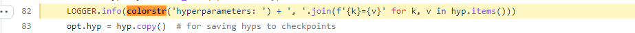
函数效果如下（可以看到输出开头、结尾变量使用其他颜色）：


## 7、check_online

这个函数是检查当前主机是否联网了。会在下面的check_git_status、check_requirements等函数中使用。

check_online函数代码:


```python
def check_online():
    """在下面的check_git_status、check_requirements等函数中使用
    检查当前主机网络连接是否可用
    """
    import socket  # 导入socket模块 可解决基于tcp和ucp协议的网络传输
    try:
        # 连接到一个ip 地址addr("1.1.1.1")的TCP服务上, 端口号port=443 timeout=5 时限5秒 并返回一个新的套接字对象
        socket.create_connection(("1.1.1.1", 443), 5)  # check host accessibility
        # 没发现什么异常, 连接成功, 有网, 就返回True
        return True
    except OSError:
        # 连接异常, 没网, 返回False
        return False
```

## 8、emojis
这个函数是忽略掉字符串中无法用ascii编码的内容(比如表情、图像)，返回Windows系统可以安全、完整显示的字符串。会在下面的check_git_status、check_requirements等函数中使用。

emojis函数代码：


```python
def emojis(str=''):
    """在下面的check_git_status、check_requirements等函数中使用
    返回Windows系统可以安全、完整显示的字符串
    Return platform-dependent emoji-safe version of string
    """
    # 通过.encode().decode()的组合忽略掉无法用ascii编码的内容(比如表情、图像)
    return str.encode().decode('ascii', 'ignore') if platform.system() == 'Windows' else str
```


```python
## 9、check_git_status

这个函数是检查当前的代码版本是否是最新的。如果不是最新的，会提示使用git pull命令进行升级。

函数代码：
```


```python

@try_except
@WorkingDirectory(ROOT)
def check_git_status(repo="Oneflow-Inc/one-yolo"):
    """用在train.py的main函数的一开始部分
    检查当前代码版本是否是最新的   如果不是最新的 会提示使用git pull命令进行升级
    """
    # YOLOv5 status check, recommend 'git pull' if code is out of date
    url = f"https://github.com/{repo}"
    msg = f", for updates see {url}"
    s = colorstr("github: ")  # string
    # 检查电脑有没有安装git仓库  没有安装直接报异常并输出异常信息
    assert Path(".git").exists(), s + "skipping check (not a git repository)" + msg
    # 检查主机是否联网
    assert check_online(), s + "skipping check (offline)" + msg

    splits = re.split(pattern=r"\s", string=check_output("git remote -v", shell=True).decode())
    matches = [repo in s for s in splits]
    if any(matches):
        remote = splits[matches.index(True) - 1]
    else:
        remote = "Oneflow-Inc"
        check_output(f"git remote add {remote} {url}", shell=True)
    check_output(f"git fetch {remote}", shell=True, timeout=5)  # git fetch
    branch = check_output("git rev-parse --abbrev-ref HEAD", shell=True).decode().strip()  # checked out
    n = int(check_output(f"git rev-list {branch}..{remote}/master --count", shell=True))  # commits behind
    if n > 0:
        # 如果不是最新  提升字符s: WARNING...
        pull = "git pull" if remote == "origin" else f"git pull {remote} master"
        s += f"⚠️ YOLOv5 is out of date by {n} commit{'s' * (n > 1)}. Use `{pull}` or `git clone {url}` to update."
    else:
        s += f"up to date with {url} ✅"
    LOGGER.info(s)
```

这个函数只用在train.py的main函数的一开始部分：
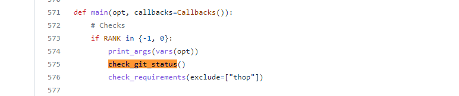

## 10、check_python、check_requirements

check_python是检查当前的版本号是否满足最小版本号minimum，

check_requirements是检查已经安装的包是否满足requirements对应txt文件的要求。

check_requirements会调用check_python。


### 10.1、check_python
这个函数是检查当前的版本号是否满足最小版本号minimum。

会在下面的check_requirements函数被调用。

check_python函数代码：


```python
def check_python(minimum='3.7.0'):
    # Check current python version vs. required python version
    check_version(platform.python_version(), minimum, name='Python ', hard=True)
```

### 10.2、check_requirements
这个函数用于检查已经安装的包是否满足requirements对应txt文件的要求。会调用colorstr、check_python、check_online等函数。

check_requirements函数代码：


```python

@TryExcept()
def check_requirements(requirements=ROOT / 'requirements.txt', exclude=(), install=True, cmds=''):
    """用在train.py、test.py、detect.py等文件
    用于检查已经安装的包是否满足requirements对应txt文件的要求
    Check installed dependencies meet requirements (pass *.txt file or list of packages)
    """
    # Check installed dependencies meet YOLOv5 requirements (pass *.txt file or list of packages or single package str)
    # 红色显示requirements单词  requirements:
    prefix = colorstr('red', 'bold', 'requirements:')
    # 检查当前的python版本符不符合最低版本要求   check python version
    check_python()  # check python version
    # 解析requirements.txt中的所有包 解析成list 里面存放着一个个的pkg_resources.Requirement类
    # 如: ['matplotlib>=3.2.2', 'numpy>=1.18.5', ……]
    if isinstance(requirements, Path):  # requirements.txt file
        file = requirements.resolve()
        assert file.exists(), f"{prefix} {file} not found, check failed."
        with file.open() as f:
            requirements = [f'{x.name}{x.specifier}' for x in pkg.parse_requirements(f) if x.name not in exclude]
    elif isinstance(requirements, str):
        requirements = [requirements]

    s = ''
    n = 0 # 统计下面程序更新包的个数 number of packages updates
    # 依次检查环境中安装的包(及每个包对应的依赖包)是否满足requirements中的每一个最低要求安装包
    for r in requirements:
        try:
            # pkg_resources.require(file) 返回对应包所需的所有依赖包 当这些包有哪个未安装或者版本不对的时候就会报错
            pkg.require(r)
        except (pkg.VersionConflict, pkg.DistributionNotFound):  # exception if requirements not met
            s += f'"{r}" '
            n += 1

    if s and install and AUTOINSTALL:  # check environment variable
        LOGGER.info(f"{prefix} YOLOv5 requirement{'s' * (n > 1)} {s}not found, attempting AutoUpdate...")
        try:
            # 再检查当前主机是否联网
            assert check_online(), "AutoUpdate skipped (offline)"
            # 最后创建一个子进程再执行pip指令并返回执行结果
            LOGGER.info(check_output(f'pip install {s} {cmds}', shell=True).decode())
            source = file if 'file' in locals() else requirements
            s = f"{prefix} {n} package{'s' * (n > 1)} updated per {source}\n" \
                f"{prefix} ⚠️ {colorstr('bold', 'Restart runtime or rerun command for updates to take effect')}\n"
            LOGGER.info(s)
        except Exception as e:
            LOGGER.warning(f'{prefix} ❌ {e}')
```

用在train.py中：

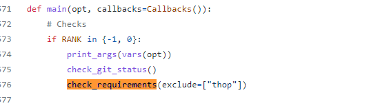

val.py 中：


## 11、make_divisible、check_img_size
这两个函数主要是用来约束图像的长款或者feature map的长款，

必须是divisor（等于算法的最大下采样率一般是32）的最小倍数。


```python
def make_divisible(x, divisor):
    """用在下面的make_divisible函数中  yolo.py的parse_model函数和commom.py的AutoShape函数中
    取大于等于x且是divisor的最小倍数
    Returns x evenly divisible by divisor
    """
    if isinstance(divisor, flow.Tensor):
        divisor = int(divisor.max())  # to int
    # math.ceil 向上取整
    return math.ceil(x / divisor) * 
```

这个函数用在下面的make_divisible函数中及 yolo.py的parse_model函数和commom.py的AutoShape函数中：
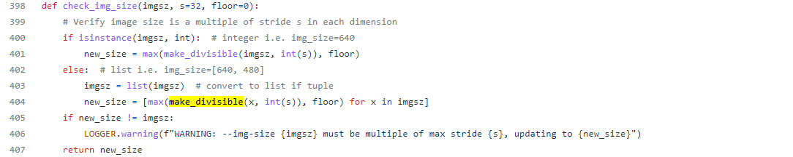

### 11.2、check_img_size
这个函数是为了保证img_size是能被s（32）整除，如果不能就返回大于等于img_size且是s的最小倍数。

这个函数本质是通过调用make_divisible函数实现的。

check_img_size函数代码：


```python
def check_img_size(imgsz, s=32, floor=0):
    """这个函数主要用于train.py中和detect.py中  用来检查图片的长宽是否符合规定
    检查img_size是否能被s整除，这里默认s为32  返回大于等于img_size且是s的最小倍数
    Verify img_size is a multiple of stride s
    """
    # Verify image size is a multiple of stride s in each dimension
    if isinstance(imgsz, int):  # integer i.e. img_size=640
        # 取大于等于x的最小值且该值能被divisor整除
        new_size = max(make_divisible(imgsz, int(s)), floor)
    else:  # list i.e. img_size=[640, 480]
        imgsz = list(imgsz)  # convert to list if tuple
        new_size = [max(make_divisible(x, int(s)), floor) for x in imgsz]
    if new_size != imgsz:
        LOGGER.warning(f"WARNING: --img-size {imgsz} must be multiple of max stride {s}, updating to {new_size}")
    return new_size
```

用来保证img的长宽符合规定，用在val.py , detect.py ,train.py中：
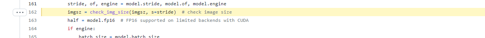


## 12、check_imshow
这个函数是检查一下前环境是否可以使用opencv.imshow显示图片。


```python
def check_imshow():
    """用在detect.py中  使用webcam的时候调用
    检查当前环境是否可以使用opencv.imshow显示图片
    主要有两点限制: Docker环境 + Google Colab环境
    """
    # Check if environment supports image displays
    try:
        assert not is_docker(), "cv2.imshow() is disabled in Docker environments"
        assert not is_colab(), "cv2.imshow() is disabled in Google Colab environments"
        # 初始化一张图片检查下opencv是否可用
        cv2.imshow("test", np.zeros((1, 1, 3)))
        cv2.waitKey(1)
        cv2.destroyAllWindows()
        cv2.waitKey(1)
        return True
    except Exception as e:
        LOGGER.warning(f"WARNING: Environment does not support cv2.imshow() or PIL Image.show() image displays\n{e}")
        return False
```

会在detect.py中使用webcam的时候调用：


## 13、check_file
这个函数是检查本都相关文件路径能否找到这个文件，没找到就说明文件丢失了，

返回空；

如果传入的是一个网络地址就直接下载这个文件；

否则找到就返回本地匹配到的第一个文件名。这个函数很有用，用的很广。


```python
def check_file(file, suffix=""):
    """用在train.py和test.py文件中  检查本地有没有这个文件
    检查相关文件路径能否找到文件 并返回文件名
    Search/download file (if necessary) and return path
    """
    # Search/download file (if necessary) and return path
    check_suffix(file, suffix)  # optional
    file = str(file)  # convert to str()
    # 如果传进来的是文件或者是’‘, 直接返回文件名str
    if Path(file).is_file() or not file:  # exists
        return file
    # 如果传进来的以 'http:/' 或者 'https:/' 开头的url地址, 就下载
    elif file.startswith(("http:/", "https:/")):  # download
        url = file  # warning: Pathlib turns :// -> :/
        file = Path(urllib.parse.unquote(file).split("?")[0]).name  # '%2F' to '/', split https://url.com/file.txt?auth
        if Path(file).is_file():
            LOGGER.info(f"Found {url} locally at {file}")  # file already exists
        else:
            LOGGER.info(f"Downloading {url} to {file}...")
            # 使用flow.hub.download_url_to_file从url地址上中下载文件名为file的文件
            flow.hub.download_url_to_file(url, file)
            # 检查是否下载成功
            assert Path(file).exists() and Path(file).stat().st_size > 0, f"File download failed: {url}"  # check
            # 返回下载的文件名
        return file
    elif file.startswith("clearml://"):  # ClearML Dataset ID
        assert "clearml" in sys.modules, "ClearML is not installed, so cannot use ClearML dataset. Try running 'pip install clearml'."
        return file
    else:  # search
        files = []
        for d in "data", "models", "utils":  # search directories
            files.extend(glob.glob(str(ROOT / d / "**" / file), recursive=True))  # find file
        assert len(files), f"File not found: {file}"  # assert file was found
        assert len(files) == 1, f"Multiple files match '{file}', specify exact path: {files}"  # assert unique
        # 返回第一个匹配到的文件名
        return files[0]  # return file
```

1. 在train.py中使用（检查本地data、cfg、hyp等文件是否存在）
2. 在test.py中使用（检查本地data文件是否存在）


## 14、check_dataset
这个函数是检查本地是否有指定的数据集，没用就从torch库中下载并解压数据集。

check_dataset函数代码:


```python
def check_dataset(data, autodownload=True):
    # Download, check and/or unzip dataset if not found locally
    """用在train.py和detect.py中 检查本地有没有数据集
    检查数据集 如果本地没有则从one-yolov5库中下载并解压数据集
    :params data: 是一个解析过的data_dict   len=7
                  例如: ['path'='../datasets/coco128', 'train','val', 'test', 'nc', 'names', 'download']
    :params autodownload: 如果本地没有数据集是否需要直接从one-yolov5库中下载数据集  默认True
    """
    # Download (optional)
    extract_dir = ""
    if isinstance(data, (str, Path)) and str(data).endswith(".zip"):  # i.e. gs://bucket/dir/coco128.zip
        download(data, dir=DATASETS_DIR, unzip=True, delete=False, curl=False, threads=1)
        data = next((DATASETS_DIR / Path(data).stem).rglob("*.yaml"))
        extract_dir, autodownload = data.parent, False

    # Read yaml (optional)
    if isinstance(data, (str, Path)):
        with open(data, errors="ignore") as f:
            data = yaml.safe_load(f)  # dictionary

    # Checks
    for k in "train", "val", "nc":
        assert k in data, f"data.yaml '{k}:' field missing ❌"
    if "names" not in data:
        LOGGER.warning("data.yaml 'names:' field missing ⚠️, assigning default names 'class0', 'class1', etc.")
        data["names"] = [f"class{i}" for i in range(data["nc"])]  # default names

    # Resolve paths
    path = Path(extract_dir or data.get("path") or "")  # optional 'path' default to '.'
    if not path.is_absolute():
        path = (ROOT / path).resolve()
    for k in "train", "val", "test":
        if data.get(k):  # prepend path
            data[k] = str(path / data[k]) if isinstance(data[k], str) else [str(path / x) for x in data[k]]

    # Parse yaml
    train, val, test, s = (data.get(x) for x in ("train", "val", "test", "download"))
    if val:
        # path.resolve() 该方法将一些的 路径/路径段 解析为绝对路径
        # val: [WindowsPath('E:/yolo_v5/datasets/coco128/images/train2017')]
        val = [Path(x).resolve() for x in (val if isinstance(val, list) else [val])]  # val path
        # 如果val不存在 说明本地不存在数据集
        if not all(x.exists() for x in val):
            LOGGER.info("\nDataset not found ⚠️, missing paths %s" % [str(x) for x in val if not x.exists()])
            if not s or not autodownload:
                raise Exception("Dataset not found ❌")
            t = time.time()
            root = path.parent if "path" in data else ".."  # unzip directory i.e. '../'
            if s.startswith("http") and s.endswith(".zip"):  # URL
                f = Path(s).name  # filename
                LOGGER.info(f"Downloading {s} to {f}...")
                flow.hub.download_url_to_file(s, f)
                Path(root).mkdir(parents=True, exist_ok=True)  # create root
                ZipFile(f).extractall(path=root)  # unzip
                Path(f).unlink()  # remove zip
                r = None  # success
            # 如果下载地址s是bash开头就使用bash指令下载数据集
            elif s.startswith("bash "):  # bash script
                LOGGER.info(f"Running {s} ...")
                # 使用bash命令下载
                r = os.system(s)
            # 否则下载地址就是一个python脚本 执行python脚本下载数据集
            else:  # python script
                r = exec(s, {"yaml": data})  # return None
            dt = f"({round(time.time() - t, 1)}s)"
            s = f"success ✅ {dt}, saved to {colorstr('bold', root)}" if r in (0, None) else f"failure {dt} ❌"
            LOGGER.info(f"Dataset download {s}")
    check_font("Arial.ttf" if is_ascii(data["names"]) else "Arial.Unicode.ttf", progress=True)  # download fonts
    return data  # dictionary
```


### 15、download
这个函数是将url中的文件下载下来，再解压。但是这个文件并没有在程序中被调用，

flow.hub.download_url_to_file系统函数和google_utils.py

中的attempt_download函数进行下载文件。所以，这个函数随便看看就好。


```python
def download(url, dir=".", unzip=True, delete=True, curl=False, threads=1, retry=3):
    # Multi-threaded file download and unzip function, used in data.yaml for autodownload
    """在coco.yaml中下载数据集
    Multi-threaded file download and unzip function
    :params url: 下载文件的url地址
    :params dir: 下载下来文件保存的目录
    :params unzip: 下载后文件是否需要解压
    :params delete: 解压后原文件(未解压)是否需要删除
    :params curl: 是否使用cmd curl语句下载文件  False就使用torch.hub下载
    :params threads: 下载一个文件需要的线程数
    """
    def download_one(url, dir):
        """
        Download 1 file
        :params url: 文件下载地址  Path(url).name=文件名
        :params dir: 文件保存的目录
        """
        # Download 1 file
        success = True
        f = dir / Path(url).name  # filename
        if Path(url).is_file():  # exists in current path
            Path(url).rename(f)  # move to dir
        # 这个目录下不存在这个文件 就直接下载
        elif not f.exists():
            LOGGER.info(f"Downloading {url} to {f}...")
            for i in range(retry + 1):
                if curl:
                    s = "sS" if threads > 1 else ""  # silent
                    r = os.system(f'curl -{s}L "{url}" -o "{f}" --retry 9 -C -')  # curl download with retry, continue
                    success = r == 0
                else:
                    flow.hub.download_url_to_file(url, f, progress=threads == 1)  # torch download
                    success = f.is_file()
                if success:
                    break
                elif i < retry:
                    LOGGER.warning(f"Download failure, retrying {i + 1}/{retry} {url}...")
                else:
                    LOGGER.warning(f"Failed to download {url}...")
        
        # 如果需要解压 且下载的文件后缀是 '.zip' 或 '.gz'
        if unzip and success and f.suffix in (".zip", ".gz"):
            LOGGER.info(f"Unzipping {f}...")
            if f.suffix == ".zip":
                ZipFile(f).extractall(path=dir)  # unzip
            elif f.suffix == ".gz":
                os.system(f"tar xfz {f} --directory {f.parent}")  # unzip
            # 解压后是否需要删除未解压的文件
            if delete:
                f.unlink()  # remove zip

    dir = Path(dir)
    dir.mkdir(parents=True, exist_ok=True)  # make directory
    if threads > 1: # 使用线程池
        # 定义了一个线程池, 最多创建threads个线程
        pool = ThreadPool(threads)
        # 进程池中的该方法会将 iterable 参数传入的可迭代对象分成 chunksize 份传递给不同的进程来处理。
        pool.imap(lambda x: download_one(*x), zip(url, repeat(dir)))  # multi-threaded
        pool.close()
        pool.join()
    else:
        for u in [url] if isinstance(url, (str, Path)) else url:
            download_one(u, dir)
```

## 16、clean_str
这个函数是将字符串中一些奇怪的符号 “|@#!¡·$€%&()=?¿^*;:,¨´><+” 换成下划线 ‘_’。


```python
def clean_str(s):
    """在datasets.py中的LoadStreams类中被调用
    字符串s里在pattern中字符替换为下划线_  注意pattern中[]不能省
    Cleans a string by replacing special characters with underscore _
    """
    # re: 用来匹配字符串（动态、模糊）的模块  正则表达式模块
    # pattern: 表示正则中的模式字符串  repl: 就是replacement的字符串  string: 要被处理, 要被替换的那个string字符串
    # 所以这句话执行的是将字符串s里在pattern中的字符串替换为 "_"
    # Cleans a string by replacing special characters with underscore _
    return re.sub(pattern="[|@#!¡·$€%&()=?¿^*;:,¨´><+]", repl="_", string=s)
```

只用在datasets.py中的LoadStreams类中：
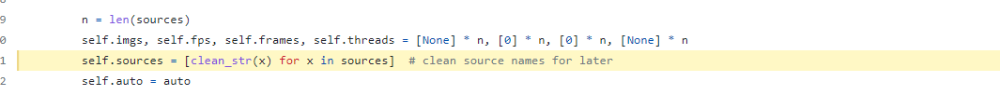

## 17. one_cycle

这个函数是一种特殊的学习率衰减策略。来自这篇论文： [one_cycle](https://arxiv.org/pdf/1803.09820.pdf). 感兴趣的
朋友可以读一读。


```python
def one_cycle(y1=0.0, y2=1.0, steps=100):
    """用在train.py的学习率衰减策略模块
    one_cycle lr  lr先增加, 再减少, 再以更小的斜率减少
    论文: https://arxiv.org/pdf/1803.09820.pdf
    """
    # lambda function for sinusoidal ramp from y1 to y2 https://arxiv.org/pdf/1812.01187.pdf
    return lambda x: ((1 - math.cos(x * math.pi / steps)) / 2) * (y2 - y1) + y1
```

一般使用one_cycle的效果会比较好。
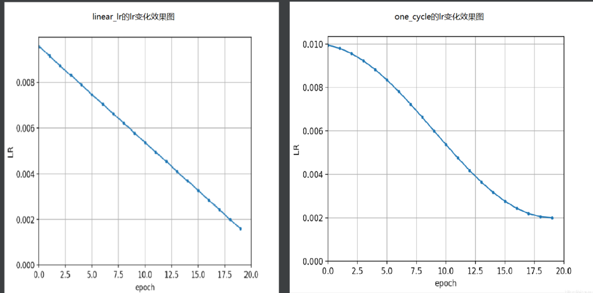

## 18. labels_to_class_weights & labels_to_image_weights
这两个函数是联合使用的。

最终的目的是为了在数据集中采样的时候，不使用随机采样，而是使用更加科学的按图片权重进行采样。

第一个函数labels_to_class_weights是为了得到数据集中所有类别的权重（频率大的权重小）。

第二个函数labels_to_image_weights是利用labels_to_class_weights函数得到的类别权重得到每张图片对应的一个权重。

然后利用每张图片的权重在当前batch进行采样，这样的采样方式会更加科学点。

两个函数都只在train.py中使用，且是同时使用的如图：


## 18.1 、labels_to_class_weights
这个函数是从训练(gt)标签获得每个类的权重 ，标签频率高的类权重低。

labels_to_class_weights函数代码：


```python
def labels_to_class_weights(labels, nc=80):
    """用在train.py中  得到每个类别的权重   标签频率高的类权重低
    从训练(gt)标签获得每个类的权重  标签频率高的类权重低
    Get class weights (inverse frequency) from training labels
    :params labels: gt框的所有真实标签labels
    :params nc: 数据集的类别数
    :return torch.from_numpy(weights): 每一个类别根据labels得到的占比(次数越多权重越小) tensor
    """
    if labels[0] is None:  # no labels loaded
        return flow.Tensor()

    labels = np.concatenate(labels, 0)  # labels.shape = (866643, 5) for COCO
    # classes: 所有标签对应的类别labels   labels[:, 0]: 类别   .astype(np.int): 取整
    classes = labels[:, 0].astype(np.int)  # labels = [labels_num, class+xywh]
    # weight: 返回每个类别出现的次数 [1, nc]
    weights = np.bincount(classes, minlength=nc)  # occurrences per class

    # Prepend gridpoint count (for uCE training)
    # gpi = ((320 / 32 * np.array([1, 2, 4])) ** 2 * 3).sum()  # gridpoints per image
    # weights = np.hstack([gpi * len(labels)  - weights.sum() * 9, weights * 9]) ** 0.5  # prepend gridpoints to start

    # 将出现次数为0的类别权重全部取1  replace empty bins with 1
    weights[weights == 0] = 1
    # 其他所有的类别的权重全部取次数的倒数  number of targets per class
    weights = 1 / weights
    # normalize 求出每一类别的占比
    weights /= weights.sum()
    return flow.from_numpy(weights)  # numpy -> tensor

```

## 18.2 labels_to_image_weights

这个函数是利用每张图片真实gt框的真实标签labels和上一步labels_to_class_weights得到的每个类别的权重得到数据集中每

张图片对应的权重。

labels_to_image_weights函数代码：


```python
def labels_to_image_weights(labels, nc=80, class_weights=np.ones(80)):
    """用在train.py中 利用上面得到的每个类别的权重得到每一张图片的权重  再对图片进行按权重进行采样
    通过每张图片真实gt框的真实标签labels和上一步labels_to_class_weights得到的每个类别的权重进行采样
    Produces image weights based on class_weights and image contents
    :params labels: 每张图片真实gt框的真实标签
    :params nc: 数据集的类别数 默认80
    :params class_weights: [80] 上一步labels_to_class_weights得到的每个类别的权重
    """
    # class_counts: 每个类别出现的次数  [num_labels, nc]  每一行是当前这张图片每个类别出现的次数  num_labels=图片数量=label数量
    class_counts = np.array([np.bincount(x[:, 0].astype(np.int), minlength=nc) for x in labels])
    # [80] -> [1, 80]
    # 整个数据集的每个类别权重[1, 80] *  每张图片的每个类别出现的次数[num_labels, 80] = 得到每一张图片每个类对应的权重[128, 80]
    # 另外注意: 这里不是矩阵相乘, 是元素相乘 [1, 80] 和每一行图片的每个类别出现的次数 [1, 80] 分别按元素相乘
    # 再sum(1): 按行相加  得到最终image_weights: 得到每一张图片对应的采样权重[128]
    return (class_weights.reshape(1, nc) * class_counts).sum(1)
```

## 19. coco80_to_coco91_class
这个函数是将80个类的coco索引换成91类的coco索引。

coco80_to_coco91_class函数代码:


```python
def coco80_to_coco91_class():
    """用在test.py中   从80类映射到91类的coco索引 取得对应的class id
    将80个类的coco索引换成91类的coco索引
    :return x: 为80类的每一类在91类中的位置
    """
    # converts 80-index (val2014) to 91-index (paper)
    # https://tech.amikelive.com/node-718/what-object-categories-labels-are-in-coco-dataset/
    # a = np.loadtxt('data/coco.names', dtype='str', delimiter='\n')
    # b = np.loadtxt('data/coco_paper.names', dtype='str', delimiter='\n')
    # x1 = [list(a[i] == b).index(True) + 1 for i in range(80)]  # darknet to coco
    # x2 = [list(b[i] == a).index(True) if any(b[i] == a) else None for i in range(91)]  # coco to darknet
    x = [1, 2, 3, 4, 5, 6, 7, 8, 9, 10, 11, 13, 14, 15, 16, 17, 18, 19, 20, 21, 22, 23, 24, 25, 27, 28, 31, 32, 33, 34,
         35, 36, 37, 38, 39, 40, 41, 42, 43, 44, 46, 47, 48, 49, 50, 51, 52, 53, 54, 55, 56, 57, 58, 59, 60, 61, 62, 63,
         64, 65, 67, 70, 72, 73, 74, 75, 76, 77, 78, 79, 80, 81, 82, 84, 85, 86, 87, 88, 89, 90]
    return x

```

在val.py中定义：


## 20. clip_coords
这个函数的作用是：

将boxes的坐标(x1y1x2y2 左上角右下角)限定在图像的尺寸(img_shape hw)内，防止出界。

这个函数会用在下面的xyxy2xywhn、save_one_boxd等函数中，很重要，必须掌握。

clip_coords函数代码：


```python
def clip_coords(boxes, shape):
    """用在下面的xyxy2xywhn、save_one_boxd等函数中
    将boxes的坐标(x1y1x2y2 左上角右下角)限定在图像的尺寸(img_shape hw)内
    Clip bounding x1y1x2y2 bounding boxes to image shape (height, width)
    """
    # Clip bounding xyxy bounding boxes to image shape (height, width)
    if isinstance(boxes, flow.Tensor):  # faster individually
        boxes[:, 0].clamp_(0, shape[1])  # x1
        boxes[:, 1].clamp_(0, shape[0])  # y1
        boxes[:, 2].clamp_(0, shape[1])  # x2
        boxes[:, 3].clamp_(0, shape[0])  # y2
    else:  # np.array (faster grouped)
        boxes[:, [0, 2]] = boxes[:, [0, 2]].clip(0, shape[1])  # x1, x2
        boxes[:, [1, 3]] = boxes[:, [1, 3]].clip(0, shape[0])  # y1, y2

```

## 21. scale_coords
这个函数是将坐标coords(x1y1x2y2)从img1_shape尺寸缩放到img0_shape尺寸。

x的正坐标是向右，y的正坐标是向下。这个函数也是很重要的。

scale_coords函数代码：


```python
def scale_coords(img1_shape, coords, img0_shape, ratio_pad=None):
    """用在detect.py和test.py中  将预测坐标从feature map映射回原图
    将坐标coords(x1y1x2y2)从img1_shape缩放到img0_shape尺寸
    Rescale coords (xyxy) from img1_shape to img0_shape
    :params img1_shape: coords相对于的shape大小
    :params coords: 要进行缩放的box坐标信息 x1y1x2y2  左上角 + 右下角
    :params img0_shape: 要将coords缩放到相对的目标shape大小
    :params ratio_pad: 缩放比例gain和pad值   None就先计算gain和pad值再pad+scale  不为空就直接pad+scale
    """
    # ratio_pad为空就先算放缩比例gain和pad值 calculate from img0_shape
    if ratio_pad is None:
        # gain  = old / new  取高宽缩放比例中较小的,之后还可以再pad  如果直接取大的, 裁剪就可能减去目标
        gain = min(img1_shape[0] / img0_shape[0], img1_shape[1] / img0_shape[1])
        # wh padding  wh中有一个为0  主要是pad另一个
        pad = (img1_shape[1] - img0_shape[1] * gain) / 2, (img1_shape[0] - img0_shape[0] * gain) / 2
    else:
        gain = ratio_pad[0][0]  # 指定比例
        pad = ratio_pad[1]  # 指定pad值

    # 因为pad = img1_shape - img0_shape 所以要把尺寸从img1 -> img0 就同样也需要减去pad
    # 如果img1_shape>img0_shape  pad>0   coords从大尺寸缩放到小尺寸 减去pad 符合
    # 如果img1_shape<img0_shape  pad<0   coords从小尺寸缩放到大尺寸 减去pad 符合
    coords[:, [0, 2]] -= pad[0]  # x padding
    coords[:, [1, 3]] -= pad[1]  # y padding
    # 缩放scale
    coords[:, :4] /= gain
    # 防止放缩后的坐标过界 边界处直接剪切
    clip_coords(coords, img0_shape)
    return coords

```


##  22. xyxy2xywh & xywh2xyxy
这两个函数是两个相反的过程。

xyxy2xywh是将预测信息xyxy格式转化为xywh的格式，而xywh2xyxy是将预测信息xywh格式转化为xyxy的格式。

这两个函数的代码很重要，一定要掌握。

代码还是那句话：x的正坐标是向右，y的正坐标是向下。

### 22.1 xyxy2xywh

这个函数是将预测信息xyxy格式转化为xywh的格式。

xyxy2xywh函数代码：


```python
def xyxy2xywh(x):
    """"用在detect.py和test.py中   操作最后, 将预测信息从xyxy格式转为xywh格式 再保存
    Convert nx4 boxes from [x1, y1, x2, y2] to [x, y, w, h] where x1y1=top-left, x2y2=bottom-right
    :params x: [n, x1y1x2y2] (x1, y1): 左上角   (x2, y2): 右下角
    :return y: [n, xywh] (x, y): 中心点  wh: 宽高
    """
    y = x.clone() if isinstance(x, flow.Tensor) else np.copy(x)
    y[:, 0] = (x[:, 0] + x[:, 2]) / 2  # x center
    y[:, 1] = (x[:, 1] + x[:, 3]) / 2  # y center
    y[:, 2] = x[:, 2] - x[:, 0]  # width
    y[:, 3] = x[:, 3] - x[:, 1]  # height
    return y
```

在detect.py中使用：
```
# Write results
for *xyxy, conf, cls in reversed(det):
    if save_txt:  # Write to file
        xywh = (xyxy2xywh(flow.tensor(xyxy).view(1, 4)) / gn).view(-1).tolist()  # normalized xywh
```

### 22.2 xywh2xyxy

这个函数是将预测信息xywh格式转化为xyxy的格式。

xywh2xyxy函数代码：


```python
def xywh2xyxy(x):
    """用在val.py中 操作之前 转为xyxy才可以进行操作
    注意: x的正方向为右面   y的正方向为下面
    Convert nx4 boxes from [x, y, w, h] to [x1, y1, x2, y2] where x1y1=top-left, x2y2=bottom-right
    :params x: [n, xywh] (x, y):
    :return y: [n, x1y1x2y2] (x1, y1): 左上角  (x2, y2): 右下角
    """
    y = x.clone() if isinstance(x, flow.Tensor) else np.copy(x)
    y[:, 0] = x[:, 0] - x[:, 2] / 2  # top left x
    y[:, 1] = x[:, 1] - x[:, 3] / 2  # top left y
    y[:, 2] = x[:, 0] + x[:, 2] / 2  # bottom right x
    y[:, 3] = x[:, 1] + x[:, 3] / 2  # bottom right y
    return y
```

## 23. xywhn2xyxy & xyxy2xywhn & xyn2xy
这三个函数主要用于dataloaders.py文件中。主要是对图像进行一些变换操作。

xywhn2xyxy是将xywh(normalized) -> x1y1x2y2。xyxy2xywhn是将x1y1x2y2 -> xywh(normalized)。

xyn2xy是将xy(normalized) -> xy。这三个函数也是比较重要的，大家必须掌握。

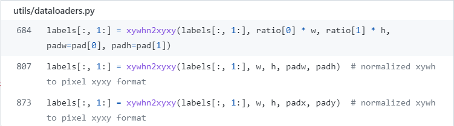

### 23.1 xywhn2xyxy

这个函数是xywh(normalized) -> x1y1x2y2。

xywhn2xyxy函数代码:


```python
def xywhn2xyxy(x, w=640, h=640, padw=0, padh=0):
    """用在dataloaders.py的 LoadImagesAndLabels类的__getitem__函数、load_mosaic、load_mosaic9等函数中  
    将xywh(normalized) -> x1y1x2y2   (x, y): 中间点  wh: 宽高   (x1, y1): 左上点  (x2, y2): 右下点
    Convert nx4 boxes from [x, y, w, h] normalized to [x1, y1, x2, y2] where xy1=top-left, xy2=bottom-right
    """
    y = x.clone() if isinstance(x, torch.Tensor) else np.copy(x)
    y[:, 0] = w * (x[:, 0] - x[:, 2] / 2) + padw  # top left x
    y[:, 1] = h * (x[:, 1] - x[:, 3] / 2) + padh  # top left y
    y[:, 2] = w * (x[:, 0] + x[:, 2] / 2) + padw  # bottom right x
    y[:, 3] = h * (x[:, 1] + x[:, 3] / 2) + padh  # bottom right y
    return y
```

### 23.2 xyxy2xywhn
这个函数是将x1y1x2y2 -> xywh(normalized)。

xyxy2xywhn函数代码：


```python
def xyxy2xywhn(x, w=640, h=640, clip=False, eps=0.0):
    """用在dataloaders.py的 LoadImagesAndLabels类的__getitem__函数中
    将 x1y1x2y2 -> xywh(normalized)  (x1, y1): 左上点  (x2, y2): 右下点  (x, y): 中间点  wh: 宽高
    Convert nx4 boxes from [x1, y1, x2, y2] to [x, y, w, h] normalized where xy1=top-left, xy2=bottom-right
    """
    # Convert nx4 boxes from [x1, y1, x2, y2] to [x, y, w, h] normalized where xy1=top-left, xy2=bottom-right
    if clip:
        clip_coords(x, (h - eps, w - eps))  # warning: inplace clip
    y = x.clone() if isinstance(x, flow.Tensor) else np.copy(x)
    y[:, 0] = ((x[:, 0] + x[:, 2]) / 2) / w  # x center
    y[:, 1] = ((x[:, 1] + x[:, 3]) / 2) / h  # y center
    y[:, 2] = (x[:, 2] - x[:, 0]) / w  # width
    y[:, 3] = (x[:, 3] - x[:, 1]) / h  # height
    return y
```

### 23.3 xyn2xy
这个函数是将xy(normalized) -> xy。

xyn2xy函数代码：


```python
def xyn2xy(x, w=640, h=640, padw=0, padh=0):
    """用在dataloaders.py的load_mosaic和load_mosaic9函数中
    xy(normalized) -> xy
    Convert normalized segments into pixel segments, shape (n,2)
    """
    # Convert normalized segments into pixel segments, shape (n,2)
    y = x.clone() if isinstance(x, flow.Tensor) else np.copy(x)
    y[:, 0] = w * x[:, 0] + padw  # top left x
    y[:, 1] = h * x[:, 1] + padh  # top left y
    return 
```

### 24、non_max_suppression
NMS(非极大值抑制)，这个函数相信大家都已经很熟悉了，这是目标检测最基本的操作之一了。

可以说这个函数是这篇博客当中最重要的代码也不为过，所以大家一定要掌握这个函数（流程原理+代码）。

更多关于nms请参阅：[《nms》](https://blog.csdn.net/qq_38253797/article/details/117920079)

non_max_suppression函数代码：


```python
def non_max_suppression(
    prediction, #  [batch, num_anchors(3个yolo预测层), (x+y+w+h+1+num_classes)] = [1, 18900, 25]  
    # 3个anchor的预测结果总和
    conf_thres=0.25, # 先进行一轮筛选，将分数过低的预测框（<conf_thres）删除（分数置0）
    iou_thres=0.45, # iou阈值, 如果其余预测框与target的iou>iou_thres, 就将那个预测框置0
    classes=None, # 是否nms后只保留特定的类别 默认为None
    agnostic=False,# 进行nms是否也去除不同类别之间的框 默认False
    multi_label=False, # 是否是多标签  nc>1  一般是True
    labels=(), # 标签
    max_det=300, # 每张图片的最大目标个数 默认1000
):
    """Non-Maximum Suppression (NMS) on inference results to reject overlapping bounding boxes
    Returns:
         list of detections, on (n,6) tensor per image [xyxy, conf, cls]
    """
    if isinstance(prediction, (list, tuple)):  # YOLOv5 model in validation model, output = (inference_out, loss_out)
        prediction = prediction[0]  # select only inference output
    # Settings  设置一些变量
    bs = prediction.shape[0]  # batch size
    nc = prediction.shape[2] - 5  # number of classes
    xc = prediction[..., 4] > conf_thres  # candidates

    # Checks
    assert 0 <= conf_thres <= 1, f"Invalid Confidence threshold {conf_thres}, valid values are between 0.0 and 1.0"
    assert 0 <= iou_thres <= 1, f"Invalid IoU {iou_thres}, valid values are between 0.0 and 1.0"

    # Settings
    # min_wh = 2  # (pixels) minimum box width and height
    # (pixels) 预测物体宽度和高度的大小范围 [min_wh, max_wh]
    max_wh = 7680  # (pixels) maximum box width and height
    # 每个图像最多检测物体的个数  maximum number of boxes into torchvision.ops.nms()
    max_nms = 30000  # maximum number of boxes into flow.nms()
    # nms执行时间阈值 超过这个时间就退出了 seconds to quit after
    time_limit = 0.3 + 0.03 * bs  # seconds to quit after
    # 是否需要冗余的detections require redundant detections
    redundant = True  # require redundant detections
    multi_label &= nc > 1  # multiple labels per box (adds 0.5ms/img)
    merge = False  # use merge-NMS
    
    t = time.time() # 记录当前时刻时间
    output = [flow.zeros((0, 6), device=prediction.device)] * bs
    for xi, x in enumerate(prediction):  # image index, image inference
        # Apply constraints
        # x[((x[..., 2:4] < min_wh) | (x[..., 2:4] > max_wh)).any(1), 4] = 0  # width-height
        x = x[xc[xi]]  # confidence
        # {list: bs} 第一张图片的target[17, 5] 第二张[1, 5] 第三张[7, 5] 第四张[6, 5]
        # Cat apriori labels if autolabelling 自动标注label时调用  一般不用
        # 自动标记在非常高的置信阈值（即 0.90 置信度）下效果最佳,而 mAP 计算依赖于非常低的置信阈值（即 0.001）来正确评估 PR 曲线下的区域。
        # 这个自动标注我觉得应该是一个类似RNN里面的Teacher Forcing的训练机制 就是在训练的时候跟着老师(ground truth)走
        # 但是这样又会造成一个问题: 一直靠老师带的孩子是走不远的 这样的模型因为依赖标签数据,在训练过程中,模型会有较好的效果
        # 但是在测试的时候因为不能得到ground truth的支持, 所以如果目前生成的序列在训练过程中有很大不同, 模型就会变得脆弱。
        # 所以个人认为(个人观点): 应该在下面使用的时候有选择的开启这个trick 比如设置一个概率p随机开启 或者在训练的前n个epoch使用 后面再关闭

        # Cat apriori labels if autolabelling
        if labels and len(labels[xi]):
            lb = labels[xi]
            v = flow.zeros((len(lb), nc + 5), device=x.device)
            v[:, :4] = lb[:, 1:5]  # box
            v[:, 4] = 1.0  # conf
            v[range(len(lb)), lb[:, 0].long() + 5] = 1.0  # cls
            x = flow.cat((x, v), 0)

        # If none remain process next image
        # 经过前两层过滤后如果该feature map没有目标框了，就结束这轮直接进行下一张图
        if not x.shape[0]:
            continue

        # Compute conf 计算conf_score
        x[:, 5:] *= x[:, 4:5]  # conf = obj_conf * cls_conf

        # Box (center x, center y, width, height) to (x1, y1, x2, y2) 左上角 右下角   [59, 4]
        box = xywh2xyxy(x[:, :4])

        # Detections matrix nx6 (xyxy, conf, cls)
        if multi_label:
            # 第三轮过滤:针对每个类别score(obj_conf * cls_conf) > conf_thres    [59, 6] -> [51, 6]
            # 这里一个框是有可能有多个物体的，所以要筛选
            # nonzero: 获得矩阵中的非0(True)数据的下标  a.t(): 将a矩阵拆开
            # i: 下标 [43]   j: 类别index [43] 过滤了两个score太低的
            i, j = (x[:, 5:] > conf_thres).nonzero(as_tuple=False).T
            x = flow.cat((box[i], x[i, j + 5, None], j[:, None].float()), 1)
        else:  # best class only
            conf, j = x[:, 5:].max(1, keepdim=True) # 一个类别直接取分数最大类的即可
            x = flow.cat((box, conf, j.float()), 1)[conf.view(-1) > conf_thres] 

        # Filter by class 是否只保留特定的类别  默认None  不执行这里
        if classes is not None:
            x = x[(x[:, 5:6] == flow.tensor(classes, device=x.device)).any(1)]

        # Apply finite constraint
        # if not flow.isfinite(x).all():
        #     x = x[flow.isfinite(x).all(1)]

        # Check shape
        n = x.shape[0]  # number of boxes
        if not n:  # no boxes  如果经过第三轮过滤该feature map没有目标框了，就结束这轮直接进行下一张图
            continue
        elif n > max_nms:  # excess boxes 如果经过第三轮过滤该feature map还要很多框(>max_nms)   就需要排序
            x = x[x[:, 4].argsort(descending=True)[:max_nms]]  # sort by confidence

        # Batched NMS
        # 第4轮过滤 Batched NMS   [51, 6] -> [5, 6]
        c = x[:, 5:6] * (0 if agnostic else max_wh)  # classes
        # 做个切片 得到boxes和scores   不同类别的box位置信息加上一个很大的数但又不同的数c
        # 这样作非极大抑制的时候不同类别的框就不会掺和到一块了  这是一个作nms挺巧妙的技巧
        boxes, scores = x[:, :4] + c, x[:, 4]  # boxes (offset by class), scores
        # 返回nms过滤后的bounding box(boxes)的索引（降序排列）
        # i = torchvision.ops.nms(boxes, scores, iou_thres)  # NMS
        i = flow.nms(boxes, scores, iou_thres)  # NMS
        if i.shape[0] > max_det:  # limit detections
            i = i[:max_det]
        if merge and (1 < n < 3e3):  # Merge NMS (boxes merged using weighted mean)
            # update boxes as boxes(i,4) = weights(i,n) * boxes(n,4)
            iou = box_iou(boxes[i], boxes) > iou_thres  # iou matrix
            weights = iou * scores[None]  # box weights
            # bounding box合并  其实就是把权重和框相乘再除以权重之和
            x[i, :4] = flow.mm(weights, x[:, :4]).float() / weights.sum(1, keepdim=True)  # merged boxes
            if redundant:
                i = i[iou.sum(1) > 1]  # require redundancy

        output[xi] = x[i] # 最终输出  [5, 6]
        # 看下时间超没超时  超时没做完的就不做了
        if (time.time() - t) > time_limit:
            LOGGER.warning(f"WARNING: NMS time limit {time_limit:.3f}s exceeded")
            break  # time limit exceeded

    return output
```

这个函数一般会用再detect.py或者val.py的模型前向推理结束之后。

更多关于NMS函数流程和代码：[【YOLO-V3-SPP 源码解读】三、预测模块.](https://blog.csdn.net/qq_38253797/article/details/117920079)


## 25 strip_optimizer

这个函数是在模型训练完后, strip_optimizer函数将optimizer、training_results、updates…

从保存的模型文件ckpt中删除。

strip_optimizer函数代码：


```python
def strip_optimizer(f="best", s=""):  # from utils.general import *; strip_optimizer()
    """用在train.py模型训练完后 
    将optimizer、training_results、updates...从保存的模型文件f中删除
    Strip optimizer from 'f' to finalize training, optionally save as 's'
    :params f: 传入的原始保存的模型文件
    :params s: 删除optimizer等变量后的模型保存的地址 dir
    """
    # Strip optimizer from 'f' to finalize training, optionally save as 's'
    x = flow.load(f, map_location=flow.device("cpu")) # x: 为加载训练的模型
    if x.get("ema"):     # 如果模型是ema replace model with ema
        x["model"] = x["ema"]  # replace model with ema
    # 以下模型训练涉及到的若干个指定变量置空
    for k in "optimizer", "best_fitness", "wandb_id", "ema", "updates":  # keys
        x[k] = None
    x["epoch"] = -1 # 模型epoch恢复初始值 -1
    x["model"].half()  # to FP16
    for p in x["model"].parameters():
        p.requires_grad = False
    # 保存模型 x -> s/f
    flow.save(x, s or f)
    mb = os.path.getsize(s or f) / 1e6  # filesize
    LOGGER.info(f"Optimizer stripped from {f},{f' saved as {s},' if s else ''} {mb:.1f}MB")
```


## 26 print_mutation

这个函数用来打印进化后的超参结果和results到evolve.txt和hyp_evolved.yaml中。

print_mutation函数代码：


```python
def print_mutation(results, hyp, save_dir, bucket, prefix=colorstr("evolve: ")):
    """用在train.py的进化超参结束后  
    打印进化后的超参结果和results到evolve.txt和hyp_evolved.yaml中
    Print mutation results to evolve.txt (for use with train.py --evolve)
    :params hyp: 进化后的超参 dict {28对 key:value}
    :params results: tuple(7)   (mp, mr, map50, map50:95, box_loss, obj_loss, cls_loss)
    :params yaml_file: 要保存的进化后的超参文件名  runs\train\evolve\hyp_evolved.yaml
    :params bucket: ''
    """
    evolve_csv = save_dir / "evolve.csv"
    evolve_yaml = save_dir / "hyp_evolve.yaml"
    keys = ("metrics/precision", "metrics/recall", "metrics/mAP_0.5", "metrics/mAP_0.5:0.95", "val/box_loss", "val/obj_loss", "val/cls_loss",) + tuple(
        hyp.keys()
    )  # [results + hyps]
    keys = tuple(x.strip() for x in keys)
    vals = results + tuple(hyp.values())
    n = len(keys)

    # Download (optional)
    if bucket:
        url = f"gs://{bucket}/evolve.csv"
        if gsutil_getsize(url) > (evolve_csv.stat().st_size if evolve_csv.exists() else 0):
            os.system(f"gsutil cp {url} {save_dir}")  # download evolve.csv if larger than local

    # Log to evolve.csv
    s = "" if evolve_csv.exists() else (("%20s," * n % keys).rstrip(",") + "\n")  # add header
    with open(evolve_csv, "a") as f:
        f.write(s + ("%20.5g," * n % vals).rstrip(",") + "\n")

    # Save yaml
    with open(evolve_yaml, "w") as f:
        data = pd.read_csv(evolve_csv)
        data = data.rename(columns=lambda x: x.strip())  # strip keys
        i = np.argmax(fitness(data.values[:, :4]))  #
        generations = len(data)
        f.write(
            "# YOLOv5 Hyperparameter Evolution Results\n"
            + f"# Best generation: {i}\n"
            + f"# Last generation: {generations - 1}\n"
            + "# "
            + ", ".join(f"{x.strip():>20s}" for x in keys[:7])
            + "\n"
            + "# "
            + ", ".join(f"{x:>20.5g}" for x in data.values[i, :7])
            + "\n\n"
        )
        yaml.safe_dump(data.loc[i][7:].to_dict(), f, sort_keys=False)

    # Print to screen
    LOGGER.info(
        prefix + f"{generations} generations finished, current result:\n" + prefix + ", ".join(f"{x.strip():>20s}" for x in keys) + "\n" + prefix + ", ".join(f"{x:20.5g}" for x in vals) + "\n\n"
    )

    if bucket:
        os.system(f"gsutil cp {evolve_csv} {evolve_yaml} gs://{bucket}")  # upload
```

## 27. apply_classifier
这个函数定义了一个二级分类器来处理yolo的输出，可以将它用在detect.py中。

这里写的这个函数只是一个普通的实现，你也可以根据自己的任务改写这个函数。

不过这个函数我们几乎不会用它，因为它很容易出错。我们这里就不仔细介绍了，真的很难用到这个函数，随便看下就好。

函数代码：


```python
def apply_classifier(x, model, img, im0):
    """用在detect.py文件的nms后继续对feature map送入model2 进行二次分类
    定义了一个二级分类器来处理yolo的输出  当前实现本质上是一个参考起点，您可以使用它自行实现此项
    比如你有照片与汽车与车牌, 你第一次剪切车牌, 并将其发送到第二阶段分类器, 以检测其中的字符
    Apply a second stage classifier to yolo outputs
    https://github.com/ultralytics/yolov5/issues/2700  这个函数使用起来很容易出错 不是很推荐使用
    https://github.com/ultralytics/yolov5/issues/1472
    :params x: yolo层的输出
    :params model: 分类模型
    :params img: 进行resize + pad之后的图片
    :params im0: 原尺寸的图片
    """
    im0 = [im0] if isinstance(im0, np.ndarray) else im0
    for i, d in enumerate(x):  # per image
        if d is not None and len(d):
            d = d.clone()

            # Reshape and pad cutouts
            b = xyxy2xywh(d[:, :4])  # boxes xyxy -> xywh
            b[:, 2:] = b[:, 2:].max(1)[0].unsqueeze(1)  # rectangle to square
            b[:, 2:] = b[:, 2:] * 1.3 + 30  # pad
            d[:, :4] = xywh2xyxy(b).long()  # xywh -> xyxy

            # Rescale boxes from img_size to im0 size
            scale_coords(img.shape[2:], d[:, :4], im0[i].shape)

            # Classes
            pred_cls1 = d[:, 5].long()  # 在之前的yolo模型预测的类别
            ims = []
            for j, a in enumerate(d):  # per item
                cutout = im0[i][int(a[1]):int(a[3]), int(a[0]):int(a[2])]
                im = cv2.resize(cutout, (224, 224))  # BGR
                # cv2.imwrite('test%i.jpg' % j, cutout)

                im = im[:, :, ::-1].transpose(2, 0, 1)  # BGR to RGB, to 3x416x416
                im = np.ascontiguousarray(im, dtype=np.float32)  # uint8 to float32
                im /= 255.0  # 0 - 255 to 0.0 - 1.0
                ims.append(im)

            # 用model模型进行分类预测
            pred_cls2 = model(flow.Tensor(ims).to(d.device)).argmax(1)  # classifier prediction
            # 保留预测一致的结果
            x[i] = x[i][pred_cls1 == pred_cls2]  # retain matching class detections

    return x
```

## 28. increment_path
用于递增路径。

比如我输入路径是run/train/exp，但是发现文件夹里面已经有这个文件了，

那么就将文件路径扩展围为：runs/train/exp{sep}0, runs/exp{sep}1 etc。

increment_path函数代码：


```python
def increment_path(path, exist_ok=False, sep="", mkdir=False):
    """这是个用处特别广泛的函数 train.py、detect.py、test.py等都会用到
    递增路径 如 run/train/exp --> runs/train/exp{sep}0, runs/exp{sep}1 etc.
    :params path: window path   run/train/exp
    :params exist_ok: False
    :params sep: exp文件名的后缀  默认''
    :params mkdir: 是否在这里创建dir  False
    """
    # Increment file or directory path, i.e. runs/exp --> runs/exp{sep}2, runs/exp{sep}3, ... etc.
    path = Path(path)  # os-agnostic
    # 如果该文件夹已经存在 则将路径run/train/exp修改为 runs/train/exp1
    if path.exists() and not exist_ok:
        # path.suffix 得到路径path的后缀  ''
        path, suffix = (path.with_suffix(""), path.suffix) if path.is_file() else (path, "")
        
        # Method 1
        for n in range(2, 9999):
            p = f"{path}{sep}{n}{suffix}"  # increment path
            if not os.path.exists(p):  #
                break
        path = Path(p)

        # Method 2 (deprecated)
        # dirs = glob.glob(f"{path}{sep}*")  # similar paths
        # matches = [re.search(rf"{path.stem}{sep}(\d+)", d) for d in dirs]
        # i = [int(m.groups()[0]) for m in matches if m]  # indices
        # n = max(i) + 1 if i else 2  # increment number
        # path = Path(f"{path}{sep}{n}{suffix}")  # increment path

    if mkdir:
        path.mkdir(parents=True, exist_ok=True)  # make directory

    return path
```

## 29. resample_segments
这个函数是 对segment重新采样，比如说segment坐标只有100个，通过interp函数将其采样为n个(默认1000)。

resample_segments函数代码：


```python
def resample_segments(segments, n=1000):
    """用在augmentations.py文件中的random_perspective函数中
    对segment重新采样，比如说segment坐标只有100个，通过interp函数将其采样为n个(默认1000)
    :params segments: [N, x1x2...]
    :params n: 采样个数
    :return segments: [N, n/2, 2]
    """
    # Up-sample an (n,2) segment
    for i, s in enumerate(segments):
        s = np.concatenate((s, s[0:1, :]), axis=0)
        x = np.linspace(0, len(s) - 1, n)
        xp = np.arange(len(s))
        # 对所有的segments都进行重新采样 比如说segment坐标只有100个，通过interp函数将其采样为n个(默认1000)
        segments[i] = np.concatenate([np.interp(x, xp, s[:, i]) for i in range(2)]).reshape(2, -1).T  # segment xy0
    return segments
```

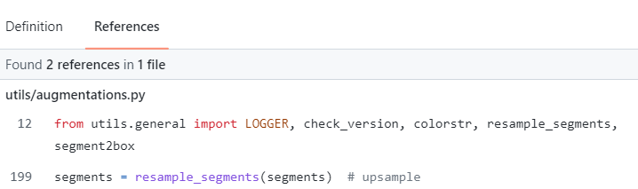

## 30. segment2box

这个函数是将一个多边形标签(不是矩形标签 到底是几边形未知)转化为一个矩形标签。

segment2box函数代码：


```python
def segment2box(segment, width=640, height=640):
    """用在augmentations.py文件中的random_perspective函数中
    将一个多边形标签(不是矩形标签  到底是几边形未知)转化为一个矩形标签
    方法: 对多边形所有的点x1y1 x2y2...  获取其中的(x_min,y_min)和(x_max,y_max) 作为矩形label的左上角和右下角
    Convert 1 segment label to 1 box label, applying inside-image constraint
    :params segment: 一个多边形标签 [n, 2] 传入这个多边形n个顶点的坐标
    :params width: 这个多边形所在图片的宽度
    :params height: 这个多边形所在图片的高度
    :return 矩形标签 [1, x_min+y_min+x_max+y_max]
    """
    # 分别获取当前多边形中所有多边形点的x和y坐标
    x, y = segment.T  # segment xy
    # inside: 筛选条件 xy坐标必须大于等于0 x坐标必须小于等于宽度 y坐标必须小于等于高度
    inside = (x >= 0) & (y >= 0) & (x <= width) & (y <= height)
    # 获取筛选后的所有多边形点的x和y坐标
    x, y, = x[inside], y[inside]
    # 取当前多边形中xy坐标的最大最小值，得到边框的坐标xyxy
    return np.array([x.min(), y.min(), x.max(), y.max()]) if any(x) else np.zeros((1, 4))

```


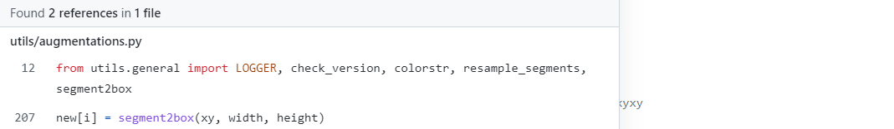

## 31. segments2boxes

这个函数是将多个多边形标签(不是矩形标签 到底是几边形未知)转化为多个矩形标签。

segments2boxes模块代码:


```python
def segments2boxes(segments):
    """用在dataloaders.py文件中的verify_image_label函数中
    将多个多边形标签(不是矩形标签  到底是几边形未知)转化为多个矩形标签
    Convert segment labels to box labels, i.e. (cls, xy1, xy2, ...) to (cls, xywh)
    :params segments: [N, cls+x1y1+x2y2 ...]
    :return [N, cls+xywh]
    """
    boxes = []
    for s in segments:
        # 分别获取当前多边形中所有多边形点的x和y坐标
        x, y = s.T
        # 取当前多边形中x和y坐标的最大最小值，得到边框的坐标xyxy
        boxes.append([x.min(), y.min(), x.max(), y.max()])
    # [N, cls+xywh]
    return xyxy2xywh(np.array(boxes))

```

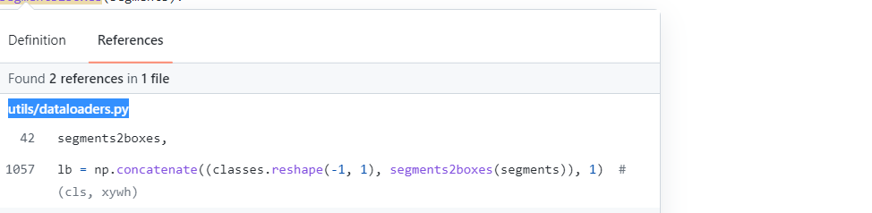

## 总结
这个文件的代码主要是一些通用的工具函数，会广泛的在整个项目的文件中使用，所以比较重要，希望大家都可以掌握。

比较重要的函数有：set_logging、init_seeds、get_latest_run、colorstr、check_git_status、check_requirements、make_divisible、check_file、check_dataset、one_cycle、labels_to_class_weights、labels_to_image_weights、strip_optimizer、print_mutation、save_one_box、increment_path。

非常重要的有：clip_coords、scale_coords、xyxy2xywh、xywh2xyxy、xywhn2xyxy、xyxy2xywhn、xyn2xy、non_max_suppression。


## Reference

- [【YOLOV5-5.x 源码解读】general.py](https://blog.csdn.net/qq_38253797/article/details/119348092)