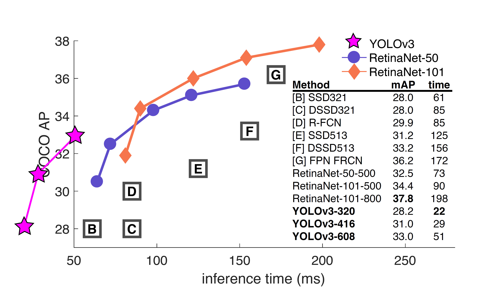
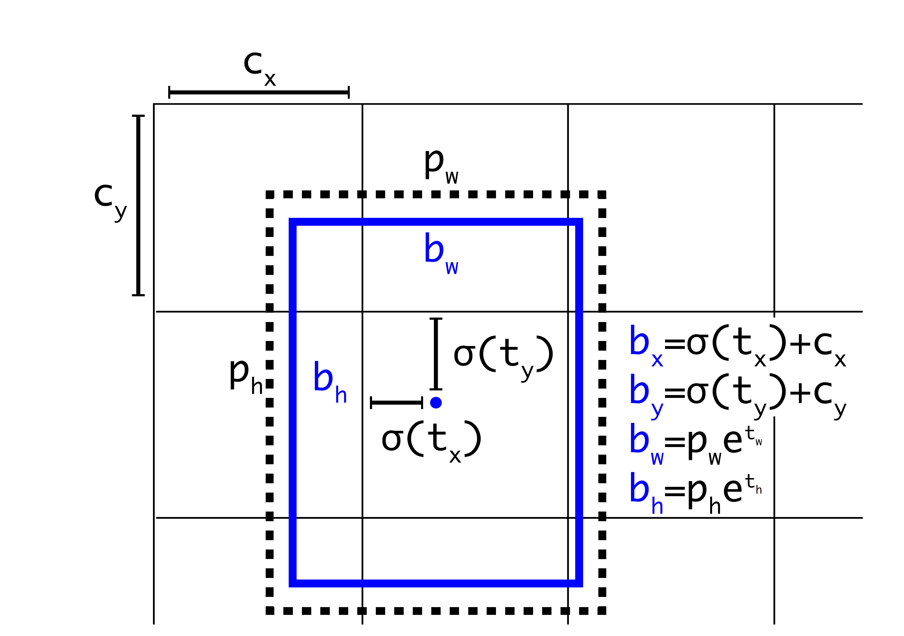

原文地址 : https://arxiv.org/pdf/1804.02767v1.pdf

 $YOLOv3$ : An Incremental Improvement

 $YOLOv3$ ：增量式的改进

Joseph Redmon Ali Farhadi

University of Washington

## 摘要
我们对YOLO进行了一系列更新！它包含一堆小设计，可以使系统的性能得到更新。我们也训练了一个新的、比较大的神经网络。虽然比上一版更大一些，但是精度也提高了。不用担心，它的速度依然很快。 $YOLOv3$ 在 $320×320$ 输入图像上运行时只需 $22ms$ ，并能达到 $28.2mAP$ ，其精度和 $SSD$ 相当，但速度要快上 $3$ 倍。使用之前 $0.5 \ IOU \ mAP$ 的检测指标， $YOLOv3$ 的效果是相当不错。 $YOLOv3$ 使用Titan X GPU，它在 $51ms$ 检测精度达到 $57.9 \ AP50$ ，然而与 $RetinaNet$ 相比 ，其精度只有 $57.5 \ AP50$ ，但却耗时 $198ms$ ，相同性能的情况下 $YOLOv3$ 速度比 $RetinaNet$ 快 $3.8$ 倍。与之前一样，所有代码在网址：https://pjreddie.com/yolo/。

## 1.引言
&emsp;有时候，一年内你主要都在玩手机，你知道吗？今年我没有做很多研究。我在 $Twitter$ 上花了很多时间,在GANs上玩了点小游戏。去年我留下了一点点的精力 [12] [1]；我设法对 $YOLO$ 进行了一些改进。但是，实话实说，仅仅一些小的改变使得它变得更好，没有什么超级有趣的事情。我也稍微帮助了其他人的一些研究。

&emsp;事实上，这就是我们今天来这里的原因。我们有一篇论文快截稿了，并且我们还缺一篇关于 $YOLO$ 更新内容的文章作为引用，但是我们没有引用来源。所以，准备好迎接科技报道吧!

&emsp;技术报告最棒的一点就是他们不需要介绍，你们都知道我们为什么在这里。因此，这篇介绍的结尾将为本文的其余部分指明方向。首先我们会告诉你 $YOLOv3$ 的方案。其次我们会告诉你我们是如何实现的。我们也会告诉你我们尝试过但并不奏效的一些事情。最后我们将探讨这些的意义。

## 2.方案
&emsp;这节主要介绍 $YOLOv3$ 的更新方案：我们主要从其他人的研究工作里获得了一些好思路、好想法。我们还训练了一个新的、比其他网络更好的分类网络。为了方便理解，让我们从头开始慢慢介绍整个模型系统。

图1. 源自 $Focal \ Loss$ 论文[9]。 $YOLOv3$ 的运行速度明显快于其他性能相当的检测方法。检测时间基于 $M40$ 或 
$Titan \ X$（*其中 $M40,Titan X$ 是相似的两种 $GPU$*）。

### 2.1 边界框预测
&emsp;和 $YOLO9000$ 一样，我们的系统也使用维度聚类算法生成的锚框（*anchor boxes*）[15] 来预测边界框。网络预测每个边界框的4个坐标：$t_x、t_y、t_w、t_h$。假设格子距离图像的左上角偏移量为 $(c_x，c_y)$，且之前的边界框的宽度和高度为 $p_w, p_h$ ，则预测结果:

$$
{\large \begin{align}
b_{x} & = \sigma\left(t_{x}\right)+c_{x} \\
b_{y} & = \sigma\left(t_{y}\right)+c_{y} \\
b_{w} & = p_{w} e^{t_{w}} \\
b_{h} & = p_{h} e^{t_{h}}
\end{align}} 
$$

&emsp;在训练中我们使用误差平方和损失计算。如果某个预测坐标的 $ground \ truth$ 是 $\hat{t}_*$ ，那么对应的梯度就是 $ground \ truth \ value$（由 $ground  \ truth  \ box$ 计算而得）和预测值之差：$\hat{t}_* - t_*$。通过变换上述公式计算,可以很容易地得到$ground \ truth \ value$。

图2： 维度先验和位置预测的边界框。$\large{\sigma(t_x)}$ , $\large{\sigma(t_y)}$  是基于矩形框中心点左上角格点坐标的偏移量，$\large{\sigma}$  是激活函数，论文中作者使用**sigmoid** [15]。 $\large{P_w,P_h}$ 是先验框的宽、高，通过上述公式，计算出实际预测框的宽高  。

 &emsp; $YOLOv3$ 使用逻辑回归预测每个边界框是目标的分数。如果真实标签框与某个边界框重叠的面积比与其他任何边界框都大，那么这个先验边界框得分为1。按照[17]的做法，如果先验边界框不是最好的，但是确实与目标的真实标签框重叠的面积大于阈值，我们也会忽略这个预测。我们使用阈值为0.5。与[17]不同的是，我们的系统只为每个真实目标分配一个边界框。如果先验边界框未分配到真实目标，则不会产生坐标或类别预测的损失，只会产生是否是目标的损失。

### 2.2 分类预测
&emsp;每个边界框都会使用多标签分类来预测框中可能包含的类。我们不用 $softmax$ ，而是用单独的逻辑分类器，因为我们发现前者对于提升网络性能没什么作用。在训练过程中，我们用binary cross-entropy（二元交叉熵）损失来预测类别。

&emsp;当我们转向更复杂的领域，例如 $Open  \ Images \ Dataset$ [7]，上面的这种改变将变得很有用。这个数据集中有许多重叠的标签（例如女性和人）。使用 $softmax$ 会假定每个框只包含一个类，但通常情况并非如此。多标签的方式可以更好地对数据进行建模。

### 2.3 跨尺度预测
 &emsp;$YOLOv3$ 在  3 种不同尺度上预测框。我们的系统使用类似特征金字塔网络的相似概念(*详细可见论文：https://arxiv.org/pdf/1612.03144.pdf*)，并从这些尺度中提取特征[8]。我们在基础特征提取器上添加了几个卷积层。其中最后一个卷积层 预测了一个编码边界框、是否是目标和类别预测结果 的三维张量。在 $COCO$ 数据集上实验[8]中，我们为每个尺度预测3个框，对于每个边界框有 4个偏移量、1个目标预测和80个类别预测，最终的张量大小为 $N×N×[3×(4+1+80)]$。

&emsp;接下来，我们从前面的2个层中提取特征图，并将其上采样2倍。我们还从网络中的较前的层中获取一个特征图，并将其与我们的上采样特征图进行拼接。这种方法使我们能够从上采样的特征图中获得更有意义的语义信息，同时可以从更前的层中获取更细粒度的信息。然后，我们添加几个卷积层来处理这个特征映射组合，并最终预测出一个相似的、大小是原先两倍的张量。

&emsp;我们再次使用相同的设计来预测最终尺寸的边界框。因此，第三个尺寸的预测将既能从所有先前的计算，又能从网络前面的层中的细粒度的特征中获益。

&emsp;我们仍然使用k-means聚类算法来确定我们的先验边界框。我们只是选择了9个聚类(*clusters*)和3个任意的尺度(*scales arbitrarily*)，
然后在尺度上将聚类均匀地划分聚类。
在 $COCO$ 数据集上，9个聚类分别 为 $(10×13)、(16×30)、(33×23)、(30×61)、(62×45)、(59×119)、(116 × 90)、(156 × 198)、(373 × 326)$ 。

### 2.4 特征提取器
&emsp;我们使用一个新的网络来进行特征提取。我们的新网络融合了 $YOLOv2、Darknet-19$ 和新发明的残差网络的思想。我们的网络使用连续的 $3×3$ 和 $1×1$ 卷积层和添加了一些快捷连接（shortcut connetction），从而规模更大，目前它有53个卷积层，所以我们称之为... $Darknet-53!$

表1. Darknet-53.

我们的网络在性能上远超Darknet-19，在效率上也优于ResNet-101和ResNet-152。这里是一些网络在ImageNet上的实验结果：

$$
\begin{eqnarray}
\text { Backbone } & \text { Top-1 } & \text { Top-5 } & \text { Bn Ops } & \text { BFLOP/s } & \text { FPS } \\
\hline \text { Darknet-19[15] } & 74.1 & 91.8 & 7.29 & 1246 & \mathbf{1 7 1} \\
\text { ResNet-101[5] } & 77.1 & 93.7 & 19.7 & 1039 & 53 \\
\text { ResNet-152[5] } & \mathbf{7 7 . 6} & \mathbf{9 3 . 8} & 29.4 & 1090 & 37 \\
\text { Darknet-53 } & 77.2 & \mathbf{9 3 . 8} & 18.7 & \mathbf{1 4 5 7} & 78
\end{eqnarray}
$$

表2.网络的比较。不同backbones的各种网络在准确度、Bn Ops（十亿操作数）、BFLOP/s（每秒十亿浮点操作）和FPS上的比较。

&emsp;每个网络都在相同的配置下进行训练，均用 $256 ×256$ 的图片上进行单精度测试。运行时间通过在 $Titan \ X$ 上处理 $256 × 256$ 图片测出。从表2可以看出，$Darknet-53$ 不仅精度可以媲美最先进的分类器，而且它有较少浮点运算操作，更快的速度。$Darknet-53$ 比 $ResNet-101$ 性能更好而且要快1.5倍。$Darknet-53$ 性能与 $ResNet-152$ 相近，但是要比它快2倍。

&emsp; $Darknet-53$ 也实现了最高的每秒浮点运算测量。这意味着网络结构可以更好地利用GPU，使其预测效率更高，速度更快。ResNets更慢，大抵是因为其层数太多，所以不是那么有效率。

### 2.5 训练
&emsp;我们依旧只是训练完整的图像，没有将难以正确分类的样本反复训练，也没有进行其他任何操作。我们使用多尺度训练，使用大量的数据增强、批量标准化等标准的操作。我们使用 $Darknet$ 神经网络框架进行训练和测试[12]。

 $YOLOv3$  is pretty good! See table 3. In terms of COCOs weird average mean AP metric it is on par with the SSD variants but is 3× faster. It is still quite a bit behind other models like RetinaNet in this metric though.

Table 3. I’m seriously just stealing all these tables from [9] they take soooo long to make from scratch. Ok,  $YOLOv3$  is doing alright. Keep in mind that RetinaNet has like 3.8× longer to process an image.  $YOLOv3$  is much better than SSD variants and comparable to state-of-the-art models on the AP50 metric.

## 3 我们是如何做的
 $YOLOv3$ 表现非常好！请看表3。就COCO的平均AP指标而言，它与SSD类的模型相当，但速度提高了3倍。尽管如此，它仍然在这个指标上比像RetinaNet这样的其他模型差些。

表3.我很认真地从[9]中 $“窃取”$了他们花了很长时间才从头开始制作这些表格。好的， $YOLOv3$ 没问题。请记住，$RetinaNet$ 处理一张图像的时间是 $YOLOv3$ 的 $3.8$ 倍。 $YOLOv3$ 比 $SSD$ 要好得多，并且在 $AP50$ 标准下可以与最先进的模型媲美！

&emsp;然而，当我们使用 $“旧的”$ 检测指标——在 $IOU=0.5的mAP$ （或图表中的$AP50$）时， $YOLOv3$ 非常强大。其性能几乎与RetinaNet相当，并且远强于 $SSD$ 。这表明 $YOLOv3$ 是一个非常强大的检测器，擅长为目标生成恰当的框。然而，随着 $IOU$ 阈值增加，性能显著下降，这表明 $YOLOv3$ 预测的边界框与目标不能完美对齐。

Figure 3. Again adapted from the [9], this time displaying speed/accuracy tradeoff on the mAP at .5 IOU metric. You can tell  $YOLOv3$  is good because it’s very high and far to the left. Can you cite your own paper? Guess who’s going to try, this guy ! [16]. Oh, I forgot, we also fix a data loading bug in YOLOv2, that helped by like 2 mAP. Just sneaking this in here to not throw off layout.

图3. 再次改编自[9]，这次显示的是在 $0.5 \ IOU$ 指标上速度/准确度的权衡。你可以说 $YOLOv3$ 是好的，因为它非常高并且在左边很远。 你能引用你自己的论文吗？猜猜谁会去尝试，这个人→[16]。哦，我忘了，我们还修复了YOLOv2中的数据加载bug，该bug的修复提升了2 mAP, 只是在这里偷偷提一下，这不是重点。

&emsp;在之前的 $YOLO$ 不擅长检测小物体。但是，现在我们看到了这种趋势的逆转。随着新的多尺度预测，我们看到 $YOLOv3$ 具有相对较高的 $APS$ 性能。但是，它在中型和大型物体检测上的性能还相对较差。这可能需要更多的调研和实验才能知道如何去改进这一点。

&emsp;当我们在 $AP50$ 指标上绘制准确度和速度关系图时（请见图3），我们看到 $YOLOv3$ 与其他检测系统相比具有显着的优势。也就是说 $YOLOv3$ ，速度更快、性能更好。

## 4 失败的尝试
&emsp;我们在实现 $YOLOv3$ 的过程中尝试了很多东西，但是很多都失败了，以下是我们还记得的一些失败的尝试。

&emsp; **Anchor框的x、y偏移预测**。我们尝试使用常规的Anchor框预测机制，比如利用线性激活将坐标x、y的偏移程度预测为边界框宽度或高度的倍数。但我们发现这种方法降低了模型的稳定性，并且效果不佳。

&emsp;**用线性激活代替逻辑激活函数进行x、y预测**。我们尝试使用线性激活代替逻辑激活来直接预测x、y偏移。这个改变导致mAP下降了几个点。

&emsp; **focal loss**。我们尝试使用focal loss。它使得mAP下降2个点。 $YOLOv3$ 可能已经对focal loss 试图解决的问题具有相当的鲁棒性，因为它具有单独的目标预测和条件类别预测。因此，对于大多数样本来说，类别预测没有损失？或者有一些？我们并不完全确定。

&emsp;**双IOU阈值和真值分配**。 $Faster \ R-CNN$ 在训练期间使用两个 $IOU$ 阈值。如果一个预测与真实标签框重叠超过 $0.7$ ，它就是一个正样本，若重叠在 $[0.3，0.7]$ 之间，那么它会被忽略，若它与所有的真实标签框的 $IOU$ 小于0.3，那么就会被判定为一个负样本。我们尝试了类似的策略，但最终的效果并不好。

&emsp;我们非常喜欢目前的模型，它至少在局部达到了最佳。上述的有些技术可能会使我们的模型更好，但我们可能还需要对他们做一些调整。

## 5 这一切意味着什么

&emsp; $YOLOv3$ 是一个很棒的检测器，它由准又快。虽然它在 $COCO$ 数据集上，0.3和0.95 IOU 下的平均AP并不好，但在旧的 0.5 IOU的检测指标下，它还是非常不错的。

&emsp; 为什么我们要改变指标？ $COCO$ 的原论文有这样一句含糊不清的句子：$“A \ full \ discussion \ of \ evaluation  \ metrics \ will \ be \ added \ once \ the \ evaluation \ server \ is \ complete”$ 。Russakovsky等人的报告中说，人们很难区分0.3和0.5的IOU。“训练人类用视觉检查0.3 IOU的边界框，并且与0.5 IOU的框区别开来是非常困难的。“[16]如果人类很难说出差异，那么它也没有多重要吧？

&emsp;也许有个更好的问题值得我们探讨“我们用它来干什么”许多从事这项研究的人都在Google和Facebook，我想至少我们知道这个技术是掌握在好人手里，绝对不会把它用来收集你的个人信息然后卖给……等等，你究竟想用它来干嘛！！噢。

&emsp;其他花大钱资助视觉研究的人还有军方，他们从来没有做过任何可怕的事情，例如用新技术杀死很多人，等等.....

我强烈地希望，大多数使用计算机视觉的人都用它来做一些快乐且有益的事情，比如计算一个国家公园里斑马的数量[13]，或者追踪在附近徘徊的猫[19]。但计算机视觉已经被用于值得怀疑的用途，作为研究人员，我们有责任考虑我们的工作可能造成的损害，并思考如何减轻它的影响。我们欠这个世界太多。

最后，不要再@我了。（因为我已经退出Twitter这个是非之地了）。

In closing, do not@me. (Because I finally quit Twitter).

## References

- [1] Analogy. Wikipedia, Mar 2018. 1 
- [2] M. Everingham, L. V an Gool, C. K. Williams, J. Winn, and A. Zisserman. The pascal visual object classes (voc) challenge. International journal of computer vision, 88(2):303– 338, 2010. 6 
- [3] C.-Y . Fu, W. Liu, A. Ranga, A. Tyagi, and A. C. Berg.
Dssd: Deconvolutional single shot detector. arXiv preprint arXiv:1701.06659, 2017. 3 
- [4] D. Gordon, A. Kembhavi, M. Rastegari, J. Redmon, D. Fox, and A. Farhadi. Iqa: Visual question answering in interactive environments. arXiv preprint arXiv:1712.03316, 2017. 1 
- [5] K. He, X. Zhang, S. Ren, and J. Sun. Deep residual learning for image recognition. In Proceedings of the IEEE conference on computer vision and pattern recognition, pages 770–778, 2016. 3 
- [6] J. Huang, V . Rathod, C. Sun, M. Zhu, A. Korattikara, A. Fathi, I. Fischer, Z. Wojna, Y . Song, S. Guadarrama, et al
Speed/accuracy trade-offs for modern convolutional object detectors. 3 
- [7] I. Krasin, T. Duerig, N. Alldrin, V . Ferrari, S. Abu-El-Haija, A. Kuznetsova, H. Rom, J. Uijlings, S. Popov, A. V eit, S. Belongie, V . Gomes, A. Gupta, C. Sun, G. Chechik, D. Cai, Z. Feng, D. Narayanan, and K. Murphy. Openimages: A public dataset for large-scale multi-label and multi-class image classification. Dataset available from https://github.com/openimages, 2017. 2 
- [8] T.-Y . Lin, P . Dollar, R. Girshick, K. He, B. Hariharan, and S. Belongie. Feature pyramid networks for object detection.
In Proceedings of the IEEE Conference on Computer Vision and Pattern Recognition, pages 2117–2125, 2017. 2, 3 
- [9] T.-Y . Lin, P . Goyal, R. Girshick, K. He, and P . Dollár.
Focal loss for dense object detection. arXiv preprint arXiv:1708.02002, 2017. 1, 3, 4 
- [10] T.-Y . Lin, M. Maire, S. Belongie, J. Hays, P . Perona, D. Ramanan, P . Dollár, and C. L. Zitnick. Microsoft coco: Common objects in context. In European conference on computer vision, pages 740–755. Springer, 2014. 2 
- [11] W. Liu, D. Anguelov, D. Erhan, C. Szegedy, S. Reed, C.Y . Fu, and A. C. Berg. Ssd: Single shot multibox detector.
In European conference on computer vision, pages 21–37.
Springer, 2016. 3 
- [12] I. Newton. Philosophiae naturalis principia mathematica.
William Dawson & Sons Ltd., London, 1687. 1 
- [13] J. Parham, J. Crall, C. Stewart, T. Berger-Wolf, and D. Rubenstein. Animal population censusing at scale with citizen science and photographic identification. 2017. 4 
- [14] J. Redmon. Darknet: Open source neural networks in c.
http://pjreddie.com/darknet/, 2013–2016. 3 
- [15] J. Redmon and A. Farhadi. Y olo9000: Better, faster, stronger.
In Computer Vision and Pattern Recognition (CVPR), 2017 IEEE Conference on, pages 6517–6525. IEEE, 2017. 1, 2, 3 
- [16] J. Redmon and A. Farhadi. Y olov3: An incremental improvement. arXiv, 2018. 4 
- [17] S. Ren, K. He, R. Girshick, and J. Sun. Faster r-cnn: Towards real-time object detection with region proposal networks. arXiv preprint arXiv:1506.01497, 2015. 2
- [18] O. Russakovsky, L.-J. Li, and L. Fei-Fei. Best of both
worlds: human-machine collaboration for object annotation.
In Proceedings of the IEEE Conference on Computer Vision
and Pattern Recognition, pages 2121–2131, 2015. 4
- [19] M. Scott. Smart camera gimbal bot scanlime:027, Dec 2017.
4
- [20] A. Shrivastava, R. Sukthankar, J. Malik, and A. Gupta. Be-
yond skip connections: Top-down modulation for object de-
tection. arXiv preprint arXiv:1612.06851, 2016. 3
- [21] C. Szegedy, S. Ioffe, V . V anhoucke, and A. A. Alemi.
Inception-v4, inception-resnet and the impact of residual
connections on learning. 2017. 3

