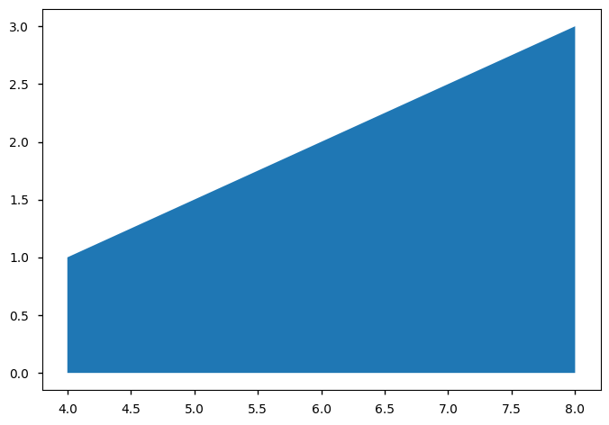

## 引言
本文主要介绍在YOLOv5项目中 计算mAP用到的一些numpy操作，函数使用在[utils/metrics.py](https://github.com/Oneflow-Inc/one-yolov5/blob/734609fca9d844ac48749b132fb0a5777df34167/utils/metrics.py)中。

用到的python/numpy的操作比如： np.cumsum()、np.interp()、np.maximum.accumulate()、np.trapz()等。接下来将在下面逐一介绍。


```python
import numpy as np
```

## np.cumsum()
返回元素沿给定轴的累积和。

numpy.cumsum(a, axis=None, dtype=None, out=None)[source](https://github.com/numpy/numpy/blob/v1.23.0/numpy/core/fromnumeric.py#L2497-L2571)

-  参数
 * a :数组
 * axis: 轴索引,整型，若a为n维数组，则axis的取值范围为[0,n-1]
 * dtype: 返回结果的数据类型，若不指定，则默认与a一致n
 * out: 数据类型为数组。用来放置结果的替代输出数组，它必须具有与输出结果具有相同的形状和缓冲长度

- 返回
* 沿着指定轴的元素累加和所组成的数组，其形状应与输入数组a一致

更多信息请参阅读:

- [API_CN](https://www.osgeo.cn/numpy/reference/generated/numpy.cumsum.html?highlight=cumsum#numpy.cumsum)
- [API_EN](https://numpy.org/doc/stable/reference/generated/numpy.cumsum.html?highlight=cumsum#numpy.cumsum)


```python
np.cumsum(a) # 计算累积和的轴。默认（无）是在展平的数组上计算cumsum。
```


    array([ 1,  3,  6, 10, 15, 21])


```python
np.cumsum(a, dtype=float)     # 指定输出的特定的类型
```


    array([ 1.,  3.,  6., 10., 15., 21.])


```python
np.cumsum(a,axis=0)      # 3列中每一列的行总和
```


    array([[1, 2, 3],
           [5, 7, 9]])


```python
x = np.ones((3,4),dtype=int) 
np.cumsum( x ,axis=0)
```


    array([[1, 1, 1, 1],
           [2, 2, 2, 2],
           [3, 3, 3, 3]])


```python
np.cumsum(a,axis=1)      # 2行中每行的列总和
```


    array([[ 1,  3,  6],
           [ 4,  9, 15]])


## np.interp()
- 参数
 * x: 数组 待插入数据的横坐标
 * xp: 一维浮点数序列 原始数据点的横坐标，如果period参数没有指定那么就必须是递增的 否则，在使用xp = xp % period正则 化之后，xp在内部进行排序
 * fp: 维浮点数或复数序列 原始数据点的纵坐标，和xp序列等长.
 * left: 可选参数，类型为浮点数或复数（对应于fp值） 当x < xp[0]时的插值返回值，默认为fp[0].
 * right: 可选参数，类型为浮点数或复数（对应于fp值），当x > xp[-1]时的插值返回值，默认为fp[-1].
 * period: None或者浮点数，可选参数 横坐标的周期 此参数使得可以正确插入angular x-coordinates. 如果该参数被设定，那么忽略left参数和right参数

- 返回
 * 浮点数或复数（对应于fp值）或ndarray. 插入数据的纵坐标，和x形状相同

注意！

在没有设置period参数时，默认要求xp参数是递增序列


```python
# 插入一个值
import numpy as np
import matplotlib.pyplot as plt
x = 2.5
xp = [1, 2, 3]
fp = [3, 2, 0]
y = np.interp(x, xp, fp)  # 1.0
plt.plot(xp, fp, '-o') 
plt.plot(x, y, 'x') # 画插值
plt.show()
```


    

    


```python
# 插入一个序列
import numpy as np
import matplotlib.pyplot as plt

x = [0, 1, 1.5, 2.72, 3.14]
xp = [1, 2, 3]
fp = [3, 2, 0]
y = np.interp(x, xp, fp)  # array([ 3. ,  3. ,  2.5 ,  0.56,  0. ])
plt.plot(xp, fp, '-o')
plt.plot(x, y, 'x')
plt.show()

```


    

    


## np.maximum.accumulate
计算数组（或数组的特定轴）的累积最大值


```python
import numpy as np
d = np.random.randint(low = 1, high = 10, size=(2,3))
print("d:\n",d)
c = np.maximum.accumulate(d, axis=1)
print("c:\n",c)   
```

    d:
     [[1 9 5]
     [2 6 1]]
    c:
     [[1 9 9]
     [2 6 6]]


## np.trapz()
numpy.trapz(y, x=None, dx=1.0, axis=- 1)
使用复合梯形规则沿给定轴积分。


```python
import matplotlib.pyplot as plt
import numpy as np
y = [1, 2, 3] ; x = [i+1 for i in range(len(y))]
print(np.trapz(x))
plt.fill_between(x, y)
plt.show() # (1 + 3)*(3 - 1)/2 = 4
```

    4.0


    

    


```python
import matplotlib.pyplot as plt
import numpy as np
y = [1, 2, 3] ; x = [4, 6, 8]
print(np.trapz(y,x))
plt.fill_between(x, y)
plt.show() # (3 + 1)*(8 - 4) / 2 = 8
```

    8.0


    

    


## 参考文章
- numpy API文档 CN： https://www.osgeo.cn/numpy/dev/index.html
- numpy API文档 EN： https://numpy.org/doc/stable/reference/index.html
- axis的基本使用： https://www.jb51.net/article/242067.htm
